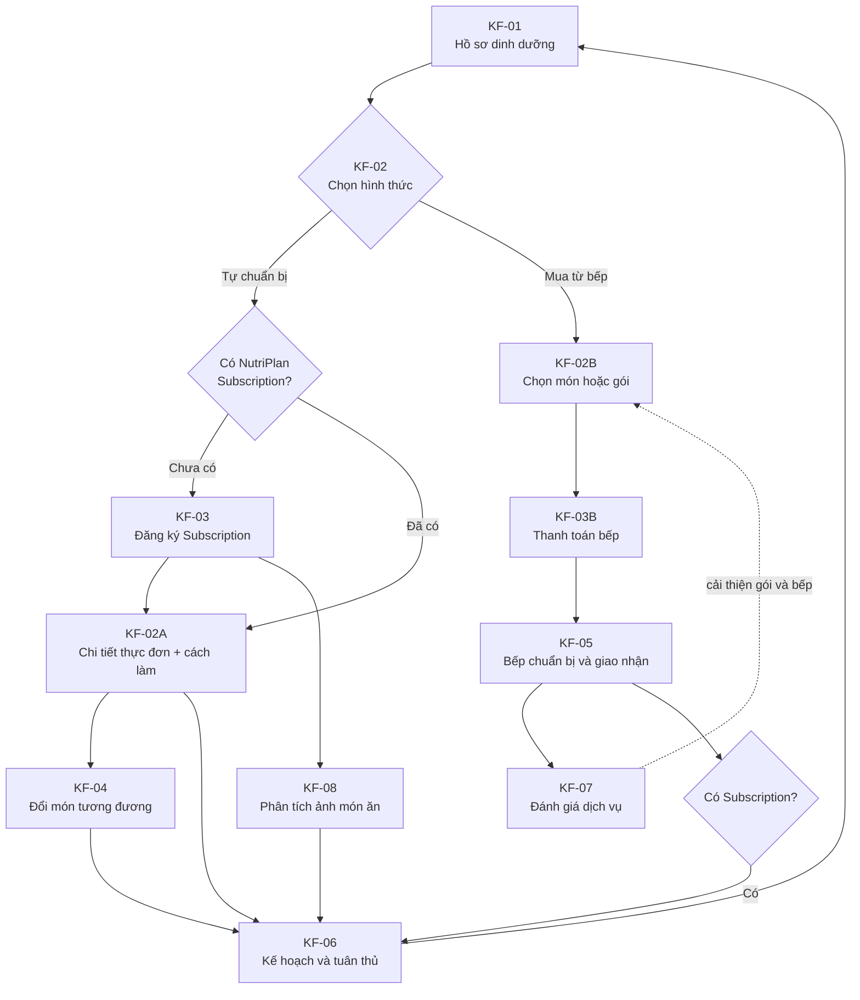

# Task 5 — Các tính năng chính của sản phẩm

> **Yêu cầu (theo Phân công PA2):** Trích xuất, phân tích và làm rõ lại các luồng nghiệp vụ từ tài liệu PA0. Bỏ qua các tính năng cơ sở hạ tầng nền tảng (như Auth, CRUD profile). Tập trung đặc tả các tính năng cốt lõi giúp định nghĩa bản sắc của dự án và trực tiếp giải quyết vấn đề của người dùng.
>
> **Outcome:** Tài liệu đặc tả tính năng chính (Key Features Specification), bao gồm phân tích chuyên sâu về luồng nghiệp vụ cho các chức năng giải quyết bài toán cốt lõi.
>
> Người thực hiện: CTO/Founding Engineer, Lead Full-stack & UI/UX Designer — Deadline: 20:00 tối 11/7

## 1. Mục tiêu và phạm vi

NutriPlan không chỉ là ứng dụng ghi nhận dinh dưỡng hoặc đặt món theo từng bữa. Sau khi tính nhu cầu dinh dưỡng cá nhân, sản phẩm cho phép người dùng chọn một trong hai hướng sử dụng độc lập:

1. **Tự chuẩn bị:** sử dụng thực đơn do NutriPlan đề xuất, xem thông tin dinh dưỡng, nguyên liệu và cách chế biến để tự nấu.
2. **Đặt bếp đối tác:** chọn thực đơn/gói ăn phù hợp do một bếp hợp tác cung cấp, bổ sung thông tin giao nhận và thanh toán theo chính sách của gói đó.

NutriPlan áp dụng mô hình **subscription cho các tính năng phân tích và quản lý kế hoạch**, không bắt buộc subscription để mua món từ bếp. Người chưa đăng ký chỉ xem bản xem trước của thực đơn NutriPlan; người đã đăng ký được mở chi tiết món/cách làm, lưu kế hoạch, ghi nhận mức độ tuân thủ và phân tích ảnh món ăn. Riêng khu vực bếp đối tác luôn cho phép mua lẻ hoặc mua gói; nếu người mua có subscription, món đã đặt sẽ được tự động ghi vào nhật ký và đưa vào phân tích dinh dưỡng.

Tài liệu chỉ đặc tả các tính năng tạo nên giá trị khác biệt đó. Các chức năng hạ tầng như đăng ký, đăng nhập, quên mật khẩu và CRUD tài khoản không được xem là tính năng chính.

## 2. Tổng quan tính năng

| Mã | Tính năng chính | Người dùng chính | Giá trị tạo ra | Core Service nguồn |
|---|---|---|---|---|
| KF-01 | Thiết lập hồ sơ và tính nhu cầu dinh dưỡng | Khách hàng | Biết lượng năng lượng và Macro phù hợp thay vì tự ước lượng | CS1 |
| KF-02 | Chọn hình thức sử dụng thực đơn | Khách hàng | Chọn tự chuẩn bị hoặc đặt bếp đối tác theo nhu cầu và khả năng chi trả | CS2 |
| KF-02A | Thực đơn NutriPlan dành cho người tự chuẩn bị | Người dùng subscription | Xem chi tiết thực đơn/cách làm và lưu kế hoạch cá nhân | CS2, CS3 |
| KF-02B | Khám phá và mua món/gói của bếp đối tác | Mọi khách hàng | Mua món phù hợp mà không bị bắt buộc đăng ký NutriPlan | CS2, CS4 |
| KF-03 | Đăng ký NutriPlan Subscription | Khách hàng | Mở khóa chi tiết thực đơn, nhật ký tuân thủ và phân tích | CS3, CS5 |
| KF-03B | Thanh toán món hoặc gói bếp đối tác | Mọi khách hàng | Mua lẻ hoặc mua gói theo giá và chính sách của bếp | CS3, CS4 |
| KF-04 | Đổi món tương đương dinh dưỡng | Khách hàng | Giảm nhàm chán mà không phá vỡ mục tiêu dinh dưỡng | CS3 |
| KF-05 | Phân phối đơn cho bếp và theo dõi thực hiện | Bếp, khách hàng | Chuyển kế hoạch số thành suất ăn thật, minh bạch trạng thái | CS4 |
| KF-06 | Theo dõi tiến trình và điều chỉnh kế hoạch | Khách hàng | Duy trì kế hoạch phù hợp khi cơ thể thay đổi | CS5 |
| KF-07 | Đánh giá bữa ăn và dịch vụ | Khách hàng, NutriPlan, bếp | Thu thập dữ liệu cải thiện món ăn và chất lượng vận hành | CS6 |
| KF-08 | Nhật ký bữa ăn và phân tích hình ảnh | Người dùng subscription | Ghi nhận món thực tế, ước tính dinh dưỡng và so sánh với kế hoạch | CS5 |

## 3. Đặc tả chi tiết

### KF-01 — Thiết lập hồ sơ và tính nhu cầu dinh dưỡng

**Vấn đề giải quyết:** Người dùng không biết cơ thể cần bao nhiêu Calorie và các chất đa lượng mỗi ngày; việc áp dụng một thực đơn chung dễ dẫn đến ăn thiếu hoặc thừa.

**Dữ liệu đầu vào:** giới tính, tuổi, chiều cao, cân nặng, mức vận động, mục tiêu (giảm cân, duy trì hoặc tăng cơ), thành phần dị ứng và hạn chế ăn uống.

**Luồng chính:**

1. Người dùng nhập các chỉ số và mục tiêu.
2. Hệ thống kiểm tra trường bắt buộc, kiểu dữ liệu và khoảng giá trị hợp lệ.
3. Hệ thống tính BMR bằng công thức dinh dưỡng được nhóm lựa chọn và công bố.
4. BMR được nhân với hệ số vận động để tạo TDEE.
5. Hệ thống áp dụng quy tắc mục tiêu để xác định mức năng lượng hằng ngày.
6. Mức năng lượng được phân bổ thành Protein, Carbohydrate và Fat theo quy tắc đã được kiểm chứng.
7. Hệ thống hiển thị kết quả, giải thích ngắn gọn và lưu thành phiên bản hồ sơ dinh dưỡng hiện hành.

**Quy tắc nghiệp vụ:**

- Không tính kết quả khi thiếu dữ liệu bắt buộc hoặc dữ liệu nằm ngoài miền cho phép.
- Dị ứng là ràng buộc loại trừ tuyệt đối khi đề xuất món; sở thích chỉ là tiêu chí ưu tiên.
- Kết quả là thông tin hỗ trợ lập kế hoạch, không thay thế chẩn đoán hoặc chỉ định y khoa.
- Nhu cầu ăn kiêng bệnh lý chỉ được hỗ trợ khi quy tắc đã được chuyên gia dinh dưỡng xác nhận; nếu chưa, hệ thống phải hiển thị cảnh báo và không tự đưa chỉ định.
- Khi thông tin cơ thể thay đổi, hệ thống tạo phiên bản mới thay vì sửa mất dữ liệu lịch sử.

**Ngoại lệ:** dữ liệu không hợp lệ; mục tiêu quá cực đoan; không có quy tắc phù hợp cho bệnh lý khai báo. Hệ thống yêu cầu sửa dữ liệu hoặc tham vấn chuyên gia, không tự sinh kế hoạch thiếu an toàn.

**Kết quả:** một Nutrition Profile gồm BMR, TDEE, mục tiêu Calorie, mục tiêu Macro và các ràng buộc thực phẩm.

### KF-02 — Chọn hình thức sử dụng thực đơn

**Vấn đề giải quyết:** Người dùng có cùng mục tiêu dinh dưỡng nhưng khác nhau về thời gian, khả năng nấu ăn và ngân sách. Ép tất cả người dùng phải mua gói giao món sẽ loại bỏ nhóm muốn tự chuẩn bị; ngược lại, chỉ đưa công thức sẽ không giải quyết nhu cầu tiện lợi của người quá bận.

**Điều kiện bắt đầu:** người dùng có Nutrition Profile hợp lệ.

**Luồng chính:**

1. Hệ thống hiển thị kết quả nhu cầu Calorie/Macro và hai lựa chọn:
   - **Tôi muốn tự chuẩn bị món ăn.**
   - **Tôi muốn đặt món từ bếp đối tác.**
2. Nếu chọn tự chuẩn bị, hệ thống chuyển sang luồng KF-02A. Người chưa có subscription chỉ xem được bản xem trước và được mời đăng ký tại KF-03.
3. Nếu chọn bếp đối tác, hệ thống chuyển sang luồng KF-02B. Luồng này không yêu cầu NutriPlan Subscription; người dùng thanh toán món/gói bếp tại KF-03B.
4. Người dùng có thể quay lại đổi lựa chọn; hai luồng không tự động tạo đơn hoặc thanh toán cho nhau.

**Quy tắc nghiệp vụ:**

- Hai lựa chọn phải được trình bày ngang hàng và mô tả rõ: ai chuẩn bị, có phát sinh thanh toán hay không và người dùng nhận được gì.
- NutriPlan Subscription và giao dịch mua món/gói bếp là hai sản phẩm độc lập, có giá và trạng thái riêng.
- Nutrition Profile và các ràng buộc dị ứng được dùng chung cho cả hai luồng.

**Kết quả:** lựa chọn của người dùng được ghi nhận và hệ thống mở đúng hành trình KF-02A hoặc KF-02B.

### KF-02A — Thực đơn NutriPlan dành cho người tự chuẩn bị

**Vấn đề giải quyết:** Người dùng muốn ăn theo mục tiêu và có khả năng tự nấu nhưng không biết chọn món, định lượng nguyên liệu hoặc cách chế biến.

**Điều kiện truy cập:** mọi người dùng có Nutrition Profile được xem tên món, hình minh họa và thông tin tổng quan của thực đơn. Chỉ người có NutriPlan Subscription `active` mới xem chi tiết từng ngày, định lượng, nguyên liệu, cách làm và sử dụng chức năng lưu/ghi nhận kế hoạch.

**Dữ liệu sử dụng:** Nutrition Profile, trạng thái NutriPlan Subscription, số bữa người dùng muốn lập kế hoạch, số ngày, sở thích, dụng cụ/thời gian nấu tùy chọn và danh mục công thức của NutriPlan.

**Luồng chính:**

1. Người dùng chọn số ngày và các bữa muốn lập kế hoạch: sáng, trưa, tối hoặc tổ hợp.
2. Người dùng có thể nhập thêm thời gian nấu tối đa, nguyên liệu không thích và dụng cụ có sẵn.
3. Hệ thống xác định phần Calorie/Macro cần đáp ứng cho các bữa đã chọn.
4. Hệ thống loại món chứa allergen hoặc vi phạm hạn chế ăn uống, sau đó ghép các món thành thực đơn.
5. Hệ thống hiển thị bản xem trước gồm một số món mẫu và tổng quan dinh dưỡng.
6. Khi người dùng bấm xem chi tiết, hệ thống kiểm tra NutriPlan Subscription:
   - Nếu chưa đăng ký/hết hạn: hiển thị quyền lợi, giá và chuyển sang KF-03 nếu người dùng đồng ý.
   - Nếu đang hoạt động: mở lịch thực đơn đầy đủ và chi tiết từng món gồm:
     - Hình ảnh và mô tả món.
     - Khẩu phần, Calorie và Protein/Carbohydrate/Fat.
     - Danh sách nguyên liệu kèm định lượng.
     - Các bước sơ chế và chế biến.
     - Thời gian, độ khó và lưu ý bảo quản/thay thế nguyên liệu nếu có.
7. Người dùng subscription có thể đổi món, lưu kế hoạch và đánh dấu món/bữa đã thực hiện.
8. Món người dùng xác nhận đã ăn được ghi vào Meal Log để so sánh với kế hoạch. Người dùng cũng có thể dùng KF-08 để chụp món ăn thực tế.
9. Luồng tự chuẩn bị không sinh Kitchen Order, Daily Order hoặc yêu cầu giao hàng.

**Quy tắc nghiệp vụ:**

- Công thức phải ghi rõ khẩu phần; dinh dưỡng của món được tính theo đúng định lượng đó.
- Backend phải kiểm tra quyền truy cập chi tiết; không chỉ ẩn nội dung ở giao diện.
- Khi subscription hết hạn, dữ liệu kế hoạch/nhật ký cũ vẫn được bảo toàn nhưng quyền xem chi tiết hoặc tạo phân tích mới tuân theo chính sách sản phẩm.
- Không hiển thị món chứa allergen đã khai báo. Gợi ý thay nguyên liệu cũng phải được kiểm tra dị ứng.
- Hệ thống phải nêu rõ thực đơn đáp ứng toàn bộ hay chỉ một phần nhu cầu trong ngày.
- Cách làm phải đủ thông tin để người dùng thực hiện, đồng thời có cảnh báo an toàn thực phẩm phù hợp.
- Nếu chưa có công thức đáng tin cậy cho một món, không được hiển thị hướng dẫn chế biến chưa được kiểm chứng.

**Kết quả:** người chưa đăng ký nhận bản xem trước; người có subscription nhận Self-prepared Meal Plan chi tiết cùng khả năng lưu và ghi nhận thực hiện.

### KF-02B — Khám phá thực đơn và gói của bếp đối tác

**Vấn đề giải quyết:** Người dùng không có thời gian hoặc điều kiện tự nấu cần một bếp thực sự có thể chuẩn bị các món phù hợp với hồ sơ dinh dưỡng và khu vực của họ.

**Dữ liệu đầu vào ban đầu:** khu vực hoặc quận giao hàng, ngày muốn nhận, bữa ăn và nhu cầu mua lẻ hoặc theo chu kỳ. Địa chỉ chi tiết và thông tin giao nhận chỉ bắt buộc khi người dùng tiến hành mua.

**Luồng chính:**

1. Người dùng truy cập khu vực bếp đối tác mà không cần NutriPlan Subscription, sau đó nhập khu vực giao, ngày nhận và nhu cầu mua lẻ/mua gói.
2. Hệ thống lọc các bếp có vùng phục vụ, lịch và năng lực phù hợp.
3. Trong từng bếp, hệ thống lọc các gói không vi phạm dị ứng/hạn chế ăn uống và xếp hạng theo độ phù hợp Calorie/Macro.
4. Hệ thống hiển thị món lẻ và gói bếp, mỗi lựa chọn ghi rõ:
   - Tên và thông tin bếp, vùng phục vụ, điểm đánh giá.
   - Món/bữa, số lượng; nếu là gói thì có thời hạn, ngày giao và thực đơn mẫu.
   - Mức Calorie/Macro dự kiến và độ phù hợp với Nutrition Profile.
   - Giá do bếp công bố, phí giao, chính sách đổi món/tạm dừng/hủy.
5. Người dùng mở một gói để xem chi tiết món, thành phần, allergen và thông tin dinh dưỡng. Cách làm chi tiết có thể không được công bố vì bếp chịu trách nhiệm chế biến.
6. Người dùng chọn món hoặc gói phù hợp và chuyển sang KF-03B để bổ sung thông tin, xác nhận và thanh toán.
7. Nếu người mua có NutriPlan Subscription đang hoạt động, hệ thống thông báo rằng các món đã giao sẽ được tự động thêm vào Meal Log; người mua không có subscription vẫn hoàn tất giao dịch bình thường.

**Quy tắc nghiệp vụ:**

- NutriPlan chỉ hiển thị món/gói đang hoạt động và bếp xác nhận còn năng lực.
- Nếu khách hàng có Nutrition Profile, không đề xuất món/gói chứa allergen đã khai báo. Nếu mua không có hồ sơ, hệ thống phải yêu cầu xác nhận thông tin dị ứng trước thanh toán.
- Nhãn “phù hợp” phải dựa trên độ lệch Calorie/Macro có thể giải thích, không chỉ dựa vào quảng cáo của bếp.
- Giá, số bữa, phí giao và chính sách hiển thị theo đúng phiên bản gói do bếp cung cấp.
- Nếu không có gói phù hợp, hệ thống thông báo rõ và cho phép đổi khu vực/thời gian hoặc quay về luồng tự chuẩn bị.

**Kết quả:** Kitchen Item hoặc Kitchen Package được lựa chọn nhưng chưa phát sinh thanh toán; trạng thái NutriPlan Subscription không chặn hành trình mua.

### KF-03 — Đăng ký NutriPlan Subscription

**Vấn đề giải quyết:** Người dùng cần trải nghiệm giá trị trước khi trả phí, trong khi các chức năng chuyên sâu như thực đơn chi tiết, lưu kế hoạch, nhật ký tuân thủ và phân tích ảnh cần một mô hình doanh thu để duy trì.

**Quyền lợi subscription:**

- Xem toàn bộ thực đơn NutriPlan và Recipe chi tiết.
- Lưu phiên bản kế hoạch, đổi món và đánh dấu món/bữa đã ăn.
- Ghi nhận tự động các món mua từ bếp đối tác vào Meal Log.
- Phân tích ảnh món ăn và so sánh lượng dinh dưỡng ước tính với kế hoạch.
- Xem báo cáo mức độ tuân thủ theo ngày/tuần và xu hướng chỉ số cơ thể.

**Luồng chính:**

1. Người dùng mở trang quyền lợi subscription từ màn hình giới hạn nội dung hoặc trang gói thành viên.
2. Hệ thống hiển thị giá, chu kỳ, quyền lợi, chính sách gia hạn/hủy và nội dung nào vẫn miễn phí.
3. Người dùng chọn gói NutriPlan, xác nhận và thanh toán.
4. Khi thanh toán thành công, hệ thống kích hoạt NutriPlan Subscription và mở quyền truy cập ngay.
5. Nếu người dùng hủy gia hạn, quyền lợi vẫn tồn tại đến hết kỳ đã thanh toán; sau đó trạng thái chuyển `expired`.

**Quy tắc nghiệp vụ:**

- Quyền truy cập chi tiết chỉ được cấp khi NutriPlan Subscription ở trạng thái `active`.
- Subscription không bao gồm giá món hoặc phí giao của bếp, trừ khi có ưu đãi được công bố riêng.
- Đăng ký hoặc hủy subscription không tự động đặt/hủy bất kỳ món ăn nào của bếp.
- Dữ liệu kế hoạch và Meal Log thuộc về tài khoản người dùng, không bị xóa khi subscription hết hạn.

**Kết quả:** NutriPlan Subscription hoạt động, gắn với tài khoản và thời hạn quyền truy cập; không sinh Kitchen Order.

### KF-03B — Thanh toán món hoặc gói của bếp đối tác

**Vấn đề giải quyết:** Người dùng cần mua món tiện lợi từ bếp mà không bị buộc trả thêm phí thành viên NutriPlan.

**Luồng chính:**

1. Hệ thống nhận món lẻ hoặc gói bếp người dùng đã chọn ở KF-02B.
2. Người dùng nhập họ tên người nhận, số điện thoại, địa chỉ, chỉ dẫn, ngày/khung giờ giao và xác nhận thông tin dị ứng.
3. Nếu mua gói, người dùng xác nhận số bữa, ngày bắt đầu và lịch giao; nếu mua lẻ, chỉ xác nhận lần giao hiện tại.
4. Hệ thống kiểm tra vùng phục vụ, năng lực bếp, tình trạng món/gói và mốc chốt.
5. Hệ thống tính tổng tiền theo giá của bếp, phí giao, giảm giá và các khoản phát sinh.
6. Người dùng xem chính sách đổi/hủy/hoàn tiền của bếp, xác nhận và thanh toán.
7. Thanh toán thành công tạo Kitchen Order; nếu mua gói, hệ thống đồng thời tạo lịch các Daily Order tương ứng.
8. Khi từng món được giao thành công:
   - Người dùng có NutriPlan Subscription: tự động ghi món, khẩu phần và dinh dưỡng công bố vào Meal Log để phân tích.
   - Người dùng không có subscription: đơn vẫn hoàn tất bình thường nhưng không mở chức năng phân tích subscription.

**Quy tắc nghiệp vụ:**

- NutriPlan Subscription không phải điều kiện mua và không được tự động thêm vào giỏ hàng.
- Giá/quyền lợi của món hoặc gói bếp được lưu theo phiên bản tại thời điểm thanh toán.
- Kitchen Order và NutriPlan Subscription có giao dịch, trạng thái và chính sách hủy độc lập.
- Thông tin dị ứng/ghi chú được chuyển cho bếp; dữ liệu thanh toán nhạy cảm không được chuyển.

**Kết quả:** Kitchen Order đã thanh toán; gói nhiều ngày có lịch Daily Order, còn mua lẻ có một Daily Order. Meal Log chỉ được tự động cập nhật nếu người mua có subscription.

### KF-04 — Đổi món tương đương dinh dưỡng

**Vấn đề giải quyết:** Thực đơn cố định dễ gây ngán, nhưng đổi món tự do có thể làm sai mục tiêu dinh dưỡng và kế hoạch nguyên liệu của bếp.

**Luồng chính:**

1. Người dùng chọn ngày và bữa muốn đổi.
2. Với luồng tự chuẩn bị, hệ thống lọc toàn bộ công thức NutriPlan phù hợp. Với gói bếp, hệ thống chỉ lọc các món bếp và gói đó cho phép đổi trước thời hạn chốt.
3. Hệ thống hiển thị phương án cùng chênh lệch dinh dưỡng/chi phí nếu có.
4. Người dùng xác nhận món thay thế.
5. Hệ thống kiểm tra lại tổng dinh dưỡng của ngày và cập nhật Meal Plan. Daily Order chỉ được cập nhật nếu thay đổi thuộc một gói bếp đã mua; mọi thay đổi đều được ghi lịch sử.

**Quy tắc nghiệp vụ:**

- Luồng tự chuẩn bị có thể đổi bất kỳ lúc nào vì không tác động đến bếp; gói bếp không cho đổi sau mốc chốt nguyên liệu, trừ khi Operations phê duyệt.
- Không được thay thế bằng món chứa allergen, kể cả khi người dùng chủ động tìm kiếm.
- Nếu món mới vượt ngưỡng dinh dưỡng hoặc không còn khả dụng, yêu cầu bị từ chối và đề xuất phương án khác.

**Kết quả:** món được đổi nhưng tổng dinh dưỡng vẫn trong ngưỡng; nếu là gói bếp, bếp nhận đúng phiên bản đơn mới nhất.

### KF-05 — Phân phối đơn cho bếp và theo dõi thực hiện

**Phạm vi áp dụng:** áp dụng cho mọi Kitchen Order đã thanh toán tại KF-03B, bất kể người mua có NutriPlan Subscription hay không.

**Vấn đề giải quyết:** Giá trị cá nhân hóa sẽ mất nếu bếp không nhận đúng định lượng, dị ứng và lịch giao; khách hàng cũng cần biết bữa ăn đang ở đâu.

**Luồng chính:**

1. Với đơn lẻ, Daily Order được tạo ngay khi thanh toán; với gói bếp, hệ thống sinh các Daily Order theo lịch của Kitchen Order.
2. Hệ thống kiểm tra lại năng lực của bếp đã gắn với Kitchen Order; nếu bếp không thể thực hiện, Operations xử lý chuyển bếp hoặc liên hệ khách theo chính sách.
3. Đơn được tổng hợp thành danh sách sản xuất theo món/định lượng nhưng vẫn giữ nhãn riêng cho từng khách và cảnh báo allergen.
4. Bếp tiếp nhận hoặc báo không thể thực hiện trước thời hạn quy định.
5. Bếp cập nhật lần lượt các trạng thái chuẩn bị và bàn giao giao nhận.
6. Đơn vị giao nhận hoặc bếp cập nhật trạng thái đang giao và kết quả giao.
7. Khách hàng theo dõi trạng thái; hệ thống thông báo khi có thay đổi hoặc sự cố.

**Trạng thái chuẩn:** `scheduled` → `sent_to_kitchen` → `accepted` → `preparing` → `out_for_delivery` → `delivered`. Nhánh lỗi gồm `rejected`, `delivery_failed`, `cancelled`.

**Quy tắc nghiệp vụ:**

- Cảnh báo allergen phải hiển thị nổi bật ở danh sách chế biến và nhãn suất ăn.
- Mọi thay đổi món/định lượng sau khi gửi bếp phải tạo phiên bản và thông báo lại.
- Bếp chỉ thấy dữ liệu cá nhân tối thiểu cần thiết để chế biến và giao hàng.
- Nếu bếp từ chối hoặc giao thất bại, hệ thống tạo cảnh báo cho Operations để xử lý, không tự đánh dấu hoàn thành.

**Kết quả:** đơn có bếp chịu trách nhiệm, lịch sử trạng thái, bằng chứng giao nhận và thông tin cho khách hàng.

### KF-06 — Theo dõi tiến trình và điều chỉnh kế hoạch

**Vấn đề giải quyết:** Nhu cầu dinh dưỡng thay đổi theo cân nặng và mức vận động; một kế hoạch cố định lâu dài sẽ mất tính phù hợp.

**Phạm vi quyền lợi:** người dùng subscription được lưu kế hoạch, Meal Log và xem phân tích tuân thủ chi tiết. Quyền nhập/chỉnh sửa dữ liệu cơ thể cơ bản có thể được duy trì miễn phí để không khóa dữ liệu cá nhân.

**Luồng chính:**

1. Kế hoạch được lưu gồm các món dự kiến theo ngày và mục tiêu Calorie/Macro.
2. Khi người dùng đánh dấu đã ăn, mua món từ bếp hoặc xác nhận kết quả KF-08, hệ thống thêm bữa thực tế vào Meal Log.
3. Hệ thống so sánh món thực tế với kế hoạch để tính mức tuân thủ theo ngày/tuần và chỉ ra phần thiếu/vượt ước tính.
4. Hệ thống nhắc người dùng cập nhật cân nặng và mức vận động theo kỳ.
5. Người dùng nhập chỉ số mới; hệ thống hiển thị xu hướng so với mục tiêu ban đầu.
6. Nếu thay đổi đủ lớn, hệ thống tính lại nhu cầu; người dùng xác nhận kế hoạch mới trước khi áp dụng.

**Quy tắc nghiệp vụ:** không khẳng định quan hệ nhân quả giữa bữa ăn và thay đổi cơ thể; không tự thay đổi các đơn bếp đã chốt; thay đổi bất thường phải kèm khuyến nghị tham vấn chuyên gia.

**Kết quả:** kế hoạch phiên bản hóa, Meal Log, báo cáo tuân thủ, lịch sử chỉ số và Nutrition Profile/Meal Plan mới khi cần.

### KF-07 — Đánh giá bữa ăn và chất lượng dịch vụ

**Vấn đề giải quyết:** NutriPlan và bếp cần dữ liệu cụ thể để phát hiện món không phù hợp, giao hàng kém hoặc sai định lượng.

**Luồng chính:**

1. Sau khi đơn ở trạng thái `delivered`, hệ thống mời người dùng đánh giá.
2. Người dùng chấm sao, chọn tiêu chí (hương vị, khẩu phần, đóng gói, đúng giờ) và có thể gửi nội dung/ảnh.
3. Hệ thống gắn phản hồi với đúng món, Daily Order và bếp thực hiện.
4. Phản hồi nghiêm trọng như nghi ngờ dị ứng, an toàn thực phẩm hoặc giao sai được chuyển thành cảnh báo ưu tiên cho Operations.
5. Dữ liệu tổng hợp được dùng để điều chỉnh danh mục món và đánh giá chất lượng bếp.

**Quy tắc nghiệp vụ:** chỉ đơn đã giao mới được đánh giá; phản hồi phải được lưu nguyên bản và có trạng thái xử lý; thông tin cá nhân không được công khai ngoài phạm vi cho phép.

**Kết quả:** đánh giá có khả năng truy vết và dữ liệu cải thiện chất lượng dịch vụ.

### KF-08 — Nhật ký bữa ăn và phân tích hình ảnh

**Vấn đề giải quyết:** Người dùng có thể ăn khác kế hoạch hoặc ăn món ngoài hệ thống nhưng không biết món thực tế chứa khoảng bao nhiêu Calorie/Macro, khiến nhật ký thiếu dữ liệu và báo cáo tuân thủ không chính xác.

**Điều kiện sử dụng:** người dùng có NutriPlan Subscription `active` và cho phép ứng dụng xử lý ảnh món ăn.

**Luồng chính:**

1. Người dùng mở “Ghi lại bữa ăn hôm nay”, chọn bữa và chụp/tải ảnh món ăn.
2. Hệ thống kiểm tra chất lượng ảnh; nếu ảnh mờ, thiếu sáng hoặc có quá nhiều món không phân biệt được, yêu cầu chụp lại hoặc nhập thủ công.
3. Mô-đun phân tích ảnh nhận diện các món/thành phần có khả năng xuất hiện và ước tính khẩu phần.
4. Hệ thống đối chiếu với dữ liệu món/Recipe để ước tính Calorie, Protein, Carbohydrate và Fat, đồng thời hiển thị độ tin cậy.
5. Người dùng kiểm tra, sửa tên món, thành phần hoặc khẩu phần trước khi xác nhận.
6. Kết quả đã xác nhận được ghi vào Meal Log và so sánh với món dự kiến trong kế hoạch ngày đó.
7. Nếu ảnh là món đã mua từ bếp đối tác, hệ thống ưu tiên dữ liệu món/khẩu phần do bếp công bố; ảnh được dùng để người dùng xác nhận hoặc phản ánh sai khác thay vì ghi đè dữ liệu chuẩn một cách tự động.

**Quy tắc nghiệp vụ:**

- Kết quả từ ảnh là **ước tính**, không được trình bày như phép đo chính xác hoặc tư vấn y khoa.
- Không lưu vào Meal Log trước khi người dùng xác nhận; luôn cho phép chỉnh sửa thủ công.
- Hệ thống phải lưu nguồn dữ liệu (`kitchen`, `recipe`, `image_estimate`, `manual`) và độ tin cậy để báo cáo không trộn lẫn dữ liệu xác định với dữ liệu ước tính.
- Ảnh là dữ liệu cá nhân: phải có mục đích sử dụng, thời hạn lưu, quyền xóa và cơ chế bảo vệ rõ ràng.
- Không được dùng ảnh để kết luận món an toàn với dị ứng; người dùng phải dựa vào thành phần được bếp/Recipe xác nhận.

**Ngoại lệ:** không nhận diện được món, nhiều người dùng chung một phần ăn, món bị che khuất, không ước lượng được khẩu phần hoặc dịch vụ phân tích lỗi. Hệ thống chuyển sang nhập thủ công thay vì tạo số liệu giả.

**Kết quả:** Meal Log Entry có món, khẩu phần, dinh dưỡng ước tính, nguồn dữ liệu, độ tin cậy và mức chênh lệch so với kế hoạch.

## 4. Quan hệ và cơ chế tương tác giữa các tính năng

KF-03 quản lý quyền lợi số của NutriPlan, còn KF-03B quản lý giao dịch món ăn của bếp; hai luồng không phụ thuộc nhau. KF-02A yêu cầu subscription để mở chi tiết và lưu kế hoạch. KF-02B/KF-03B cho phép mọi khách hàng mua món hoặc gói bếp. Sau khi bếp giao món, hệ thống chỉ tự động đưa món vào KF-06 nếu người mua có subscription. KF-08 bổ sung dữ liệu cho những bữa người dùng tự nấu hoặc ăn ngoài bằng ảnh đã được người dùng xác nhận.

## 5. Yêu cầu dữ liệu và kiểm soát xuyên suốt

| Đối tượng dữ liệu | Nội dung chính | Kiểm soát quan trọng |
|---|---|---|
| Nutrition Profile | Chỉ số cơ thể, mục tiêu, TDEE/Macro, dị ứng | Lưu phiên bản; hạn chế truy cập; không log dữ liệu nhạy cảm tùy tiện |
| Dish/Recipe | Thành phần, allergen, định lượng, Macro, giá | Có nguồn và ngày xác nhận; thay đổi phải được duyệt |
| Self-prepared Meal Plan | Món theo ngày/bữa, tổng dinh dưỡng, nguyên liệu và cách làm | Kiểm tra lại sau mọi lần đổi món; không sinh đơn bếp |
| Kitchen Package | Bếp, món/gói, chu kỳ, giá, vùng phục vụ và chính sách | Lưu phiên bản; chỉ hiển thị gói còn năng lực và phù hợp hồ sơ |
| NutriPlan Subscription | Gói quyền lợi, chu kỳ, thời hạn, trạng thái gia hạn | Tách độc lập với giao dịch bếp; kiểm tra quyền ở backend |
| Kitchen Order | Món/gói bếp, người nhận, lịch, giá, trạng thái thanh toán | Không yêu cầu subscription; lưu phiên bản giá và chính sách |
| Daily Order | Món, khẩu phần, bếp, giao nhận, trạng thái | Phiên bản đơn; cảnh báo dị ứng; lịch sử trạng thái |
| Meal Log Entry | Bữa thực tế, món, khẩu phần, dinh dưỡng, nguồn và độ tin cậy | Người dùng xác nhận; không trộn ước tính ảnh với dữ liệu chuẩn |
| Meal Image | Ảnh, thời điểm, trạng thái xử lý và quyền đồng ý | Hạn chế truy cập, cho phép xóa, có chính sách thời hạn lưu |
| Progress Entry | Cân nặng, thời điểm, ghi chú | Không suy diễn chẩn đoán y khoa |
| Feedback | Sao, tiêu chí, nội dung, ảnh | Gắn đúng đơn/bếp; quy trình xử lý sự cố |

## 6. Tiêu chí hoàn thành cấp sản phẩm

- Sau khi nhận kết quả dinh dưỡng, người dùng thấy rõ và chọn được một trong hai hành trình.
- Người chưa subscribe chỉ xem bản xem trước; người có subscription xem được chi tiết, lưu kế hoạch và ghi nhận tuân thủ.
- Mọi khách hàng đều mua được món lẻ/gói bếp mà không cần NutriPlan Subscription.
- Với người có subscription, món bếp giao thành công được ghi vào Meal Log và tham gia phân tích kế hoạch.
- Ảnh món ăn tạo kết quả ước tính có độ tin cậy, cho phép sửa và chỉ lưu sau khi người dùng xác nhận.
- Mọi món đề xuất và thay thế đều vượt qua kiểm tra dị ứng và ngưỡng dinh dưỡng.
- Một Kitchen Order đã thanh toán có thể sinh đúng Daily Order và truyền đúng thông tin cho bếp.
- Khách hàng xem được trạng thái thực tế; các tình huống thất bại không bị hiển thị nhầm là hoàn thành.
- Chỉ số cơ thể và phản hồi sau giao tạo được vòng dữ liệu để cải thiện kế hoạch tiếp theo.
- Các tuyên bố liên quan dinh dưỡng có công thức, giả định và giới hạn sử dụng rõ ràng.

## 7. Các điểm cần xác nhận trước khi phát triển

1. Công thức BMR, hệ số vận động, quy tắc điều chỉnh Calorie và phân bổ Macro.
2. Ngưỡng sai lệch Calorie/Macro cho phép khi ghép hoặc đổi món.
3. Phạm vi hỗ trợ ăn kiêng bệnh lý và người chịu trách nhiệm chuyên môn.
4. Mốc chốt đổi món, đổi lịch/địa chỉ, tạm dừng, hủy và hoàn tiền.
5. Cơ chế chọn bếp, SLA tiếp nhận/chế biến/giao hàng và quy trình xử lý sự cố.
6. Giá/chu kỳ NutriPlan Subscription và bảng giá món/gói/phí giao độc lập của từng bếp.
7. Nội dung Recipe nào được NutriPlan tự biên soạn, ai kiểm chứng và phần nào bếp được phép giữ bí quyết chế biến.
8. Thông tin bổ sung bắt buộc khi mua gói bếp: địa chỉ, số điện thoại, khung giờ, ghi chú và phương thức giao.
9. Chính sách quyền truy cập dữ liệu kế hoạch/nhật ký khi subscription hết hạn.
10. Nhà cung cấp hoặc phương án kỹ thuật phân tích ảnh, ngưỡng độ tin cậy và giới hạn số lượt theo gói.
11. Chính sách xin phép, lưu trữ và xóa ảnh món ăn của người dùng.
