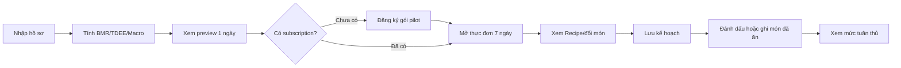
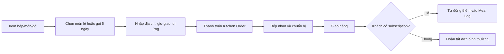
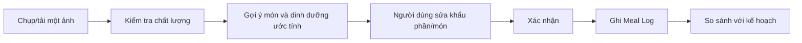

# Task 8 — Phiên bản sản phẩm tối thiểu khả thi (MVP)

> **Yêu cầu:** Lựa chọn nghiêm ngặt các tính năng từ Task 5 để đưa vào MVP; giải thích lý do kỹ thuật/nghiệp vụ và cách dùng từng tính năng để kiểm chứng thị trường.
>
> **Outcome:** MVP Scope kèm justification report, tiêu chí nghiệm thu và chỉ số validation.

## 1. Mục tiêu của MVP

MVP NutriPlan là một web application giúp người dùng:

1. Nhập chỉ số cơ thể để nhận mục tiêu Calorie/Macro và bản xem trước thực đơn phù hợp.
2. Đăng ký NutriPlan Subscription để mở thực đơn chi tiết, lưu kế hoạch và theo dõi bữa ăn.
3. Mua món lẻ hoặc gói ăn từ một bếp đối tác mà không bắt buộc subscription.
4. Nếu có subscription, ghi nhận món đã ăn từ kế hoạch, đơn bếp hoặc ảnh món ăn vào Meal Log và xem mức độ tuân thủ.

MVP không nhằm xây dựng ngay một marketplace nhiều bếp hoặc hệ thống AI dinh dưỡng hoàn chỉnh. Mục tiêu là kiểm chứng liệu khách hàng có thực sự sử dụng và trả tiền cho hai giá trị cốt lõi:

- **Giá trị số:** kế hoạch ăn uống cá nhân hóa và công cụ theo dõi.
- **Giá trị tiện lợi:** mua được món phù hợp từ bếp mà không phải tự chuẩn bị.

## 2. Khách hàng và phạm vi pilot

| Hạng mục | Phạm vi MVP |
|---|---|
| Khách hàng chính | Sinh viên và nhân viên văn phòng trẻ tại TP.HCM có mục tiêu giảm cân, duy trì cân nặng hoặc tăng cơ |
| Quy mô pilot | 10–20 người dùng |
| Địa bàn | Một khu vực giao hàng nhỏ, ưu tiên cụm trường học hoặc văn phòng |
| Đối tác | Một bếp healthy; tối đa hai bếp nếu cần phương án dự phòng |
| Chu kỳ thử nghiệm | 2–4 tuần |
| Nền tảng | Responsive web application |
| Thực đơn NutriPlan | Khoảng 20–30 món đã có dữ liệu nguyên liệu, khẩu phần, Calorie/Macro và allergen |
| Gói bếp | Món lẻ và một gói thử nghiệm 5 ngày; chưa triển khai gói tháng |

## 3. Các giả thuyết cần kiểm chứng

| Mã | Giả thuyết | Cách kiểm chứng trong MVP | Dấu hiệu đạt ban đầu |
|---|---|---|---|
| H1 | Người dùng thấy mục tiêu Calorie/Macro và thực đơn cá nhân hóa hữu ích | Theo dõi tỷ lệ hoàn thành hồ sơ và mở bản xem trước | ≥ 70% người bắt đầu hoàn thành hồ sơ; ≥ 60% xem đề xuất |
| H2 | Một phần người dùng sẵn sàng trả phí để xem chi tiết và theo dõi kế hoạch | Hiển thị paywall sau preview và cho đăng ký gói pilot | ≥ 20% người xem preview đăng ký hoặc cam kết trả phí |
| H3 | Người dùng có nhu cầu mua món phù hợp mà không cần subscription | Cho mua món lẻ/gói bếp độc lập | ≥ 30% người dùng pilot tạo ít nhất một Kitchen Order |
| H4 | Subscription tạo thói quen ghi nhận bữa ăn | Đo Meal Log trong 7 ngày | ≥ 50% subscriber ghi ít nhất 4/7 ngày |
| H5 | Phân tích ảnh làm giảm công sức ghi nhật ký | Thử bản Beta và đo tỷ lệ hoàn tất | ≥ 60% lượt tải ảnh được người dùng xác nhận sau khi xem/sửa |
| H6 | Bếp có thể thực hiện đúng thông tin món và giao hàng | Đối chiếu Daily Order, trạng thái và phản hồi | ≥ 90% đơn giao đúng món; ≥ 85% giao đúng khung giờ |

Các ngưỡng trên là mục tiêu pilot để ra quyết định, không phải bằng chứng thống kê cho toàn thị trường.

## 4. Phạm vi tính năng MVP

### 4.1 Must Have — Bắt buộc phải có

| Mã | Tính năng MVP | Phạm vi triển khai | Lý do bắt buộc |
|---|---|---|---|
| MVP-01 | Hồ sơ dinh dưỡng | Giới tính, tuổi, chiều cao, cân nặng, mức vận động, mục tiêu, dị ứng | Dữ liệu nền cho toàn bộ cá nhân hóa và kiểm soát allergen |
| MVP-02 | Tính BMR/TDEE/Macro | Một công thức BMR được xác nhận; hệ số vận động; ba mục tiêu giảm/duy trì/tăng | Nếu không có kết quả cá nhân hóa, NutriPlan không khác ứng dụng thực đơn thông thường |
| MVP-03 | Preview thực đơn | Hiển thị một ngày mẫu, tên/hình món và tổng quan dinh dưỡng; ẩn Recipe chi tiết | Tạo giá trị trước paywall và kiểm chứng mức quan tâm |
| MVP-04 | NutriPlan Subscription | Một gói pilot; thanh toán test hoặc xác nhận thanh toán thủ công; trạng thái active/expired/cancel-at-period-end | Kiểm chứng willingness-to-pay cho giá trị số |
| MVP-05 | Thực đơn chi tiết cho subscriber | Kế hoạch 7 ngày; khẩu phần, Calorie/Macro, nguyên liệu, cách làm | Đây là quyền lợi chính khiến người dùng đăng ký |
| MVP-06 | Lưu kế hoạch và Meal Log | Lưu kế hoạch 7 ngày; đánh dấu đã ăn; nhập/sửa món thủ công | Tạo vòng sử dụng lặp lại và dữ liệu đo tuân thủ |
| MVP-07 | Danh mục bếp đối tác | Một bếp, danh sách món lẻ và một gói 5 ngày; giá, allergen, vùng giao | Kiểm chứng nhu cầu mua tiện lợi và quy trình đối tác |
| MVP-08 | Kitchen Order không cần subscription | Giỏ hàng, thông tin nhận/giao, xác nhận dị ứng, thanh toán pilot | Chứng minh hai nguồn giá trị/doanh thu hoạt động độc lập |
| MVP-09 | Dashboard bếp tối giản | Xem đơn, cảnh báo dị ứng, chấp nhận và cập nhật trạng thái | Không thể kiểm chứng dịch vụ giao món nếu chưa khép kín vận hành bếp |
| MVP-10 | Theo dõi Daily Order | `scheduled` → `accepted` → `preparing` → `out_for_delivery` → `delivered`; có nhánh failed/cancelled | Tạo minh bạch và dữ liệu SLA |
| MVP-11 | Tự động ghi món bếp vào Meal Log | Chỉ khi đơn `delivered` và người mua có subscription active | Kiểm chứng lợi ích kết nối marketplace với công cụ theo dõi |
| MVP-12 | Báo cáo tuân thủ cơ bản | Tổng Calorie/Macro đã ghi so với kế hoạch theo ngày; không đưa chẩn đoán | Cho subscriber thấy giá trị từ việc ghi nhật ký |

### 4.2 Should Have — Làm nếu Must Have ổn định

| Mã | Tính năng | Phạm vi giới hạn | Lý do chưa xếp Must |
|---|---|---|---|
| MVP-13 | Đổi món tương đương | Đổi trong danh sách NutriPlan; gói bếp chỉ đổi trước cutoff và trong món bếp cho phép | Có ích để giảm ngán nhưng chưa cần để kiểm chứng giao dịch đầu tiên |
| MVP-14 | Phân tích ảnh Beta | Một ảnh/một bữa; nhận diện món gợi ý; người dùng bắt buộc sửa/xác nhận; có nhập tay khi lỗi | Rủi ro kỹ thuật cao; khẩu phần từ ảnh chỉ là ước tính |
| MVP-15 | Đánh giá đơn bếp | 1–5 sao và ghi chú sau delivered | Có thể thu phản hồi thủ công ở pilot nếu thiếu thời gian |
| MVP-16 | Cập nhật cân nặng | Nhập theo tuần và hiển thị xu hướng đơn giản | Cần ít nhất vài tuần dữ liệu mới tạo giá trị rõ |

### 4.3 Không đưa vào MVP

| Tính năng | Lý do loại khỏi MVP | Giai đoạn dự kiến |
|---|---|---|
| Tự động gia hạn và nhiều gói subscription | Một gói pilot đủ kiểm chứng willingness-to-pay; giảm độ phức tạp thanh toán | Sau pilot |
| Gói bếp theo tháng | Tăng rủi ro hoàn tiền, tạm dừng và vận hành trước khi kiểm chứng gói ngắn | Sau khi gói 5 ngày ổn định |
| Marketplace nhiều bếp và tự động phân bổ bếp | Chưa cần khi pilot chỉ có 1–2 đối tác | Giai đoạn mở rộng |
| Tối ưu tuyến giao hàng thời gian thực | Có thể dùng bếp hoặc đơn vị giao nhận xử lý thủ công | Giai đoạn mở rộng |
| Tự động điều chỉnh kế hoạch không cần xác nhận | Rủi ro thay đổi sai kế hoạch; cần dữ liệu thực tế và chuyên gia | Sau pilot |
| Tư vấn ăn kiêng bệnh lý | Rủi ro sức khỏe và pháp lý; cần chuyên gia dinh dưỡng | Chỉ triển khai khi được thẩm định |
| Nhận diện chính xác khối lượng món từ một ảnh | Chưa đủ đáng tin cậy trong điều kiện ảnh thực tế | Nghiên cứu sau MVP |
| Chatbot tư vấn, mạng xã hội, gamification | Không trực tiếp kiểm chứng hai giả thuyết doanh thu cốt lõi | Backlog tương lai |

## 5. Hai hành trình người dùng trong MVP

### 5.1 Hành trình A — Subscription và tự chuẩn bị

**Kết quả cần kiểm chứng:** người dùng hiểu preview, chấp nhận paywall, sử dụng Recipe và quay lại ghi nhật ký.

### 5.2 Hành trình B — Mua từ bếp không cần subscription

**Kết quả cần kiểm chứng:** khách mua được món mà không bị chặn bởi paywall; bếp tiếp nhận đúng dữ liệu; subscriber nhận thêm giá trị theo dõi.

### 5.3 Hành trình C — Phân tích ảnh Beta

Nếu hệ thống không nhận diện được, người dùng phải nhập thủ công. MVP không tự ghi dữ liệu ảnh chưa xác nhận.

## 6. Quy tắc nghiệp vụ bắt buộc

1. NutriPlan Subscription và Kitchen Order là hai giao dịch độc lập.
2. Không yêu cầu subscription để xem hoặc mua món/gói của bếp.
3. Chỉ subscription `active` mới mở Recipe chi tiết, lưu kế hoạch, phân tích ảnh và báo cáo tuân thủ.
4. Subscription không bao gồm tiền món hoặc phí giao của bếp.
5. Món bếp chỉ tự động vào Meal Log khi Daily Order là `delivered` và subscription còn `active`.
6. Mọi đề xuất phải loại bỏ allergen đã khai báo. Nếu khách mua bếp chưa có hồ sơ, phải xác nhận dị ứng trước thanh toán.
7. Kết quả ảnh luôn gắn nhãn “ước tính”, có độ tin cậy và cần người dùng xác nhận.
8. Hệ thống không cung cấp chẩn đoán hoặc thực đơn điều trị bệnh lý trong MVP.
9. Giá, món, chính sách và lịch giao của Kitchen Order phải được lưu tại thời điểm thanh toán.
10. Thanh toán/callback phải idempotent để không kích hoạt subscription hoặc tạo đơn hai lần.

## 7. Tiêu chí nghiệm thu

### 7.1 Hồ sơ và đề xuất

- Người dùng nhập được đầy đủ dữ liệu và nhận BMR/TDEE/Calorie/Macro.
- Input thiếu hoặc ngoài miền hợp lệ không tạo kết quả.
- Dị ứng đã khai báo loại bỏ món không an toàn khỏi cả preview và danh mục phù hợp.
- Preview không làm lộ Recipe/định lượng chi tiết dành cho subscriber.

### 7.2 Subscription

- Thanh toán thành công chuyển subscription sang `active`; lỗi thanh toán không mở quyền.
- API chi tiết từ chối người không có quyền, kể cả khi truy cập trực tiếp URL.
- Hủy gia hạn không xóa quyền trước ngày hết hạn và không ảnh hưởng Kitchen Order.
- Hết hạn không xóa hồ sơ hoặc Meal Log đã có.

### 7.3 Kế hoạch và Meal Log

- Subscriber lưu được kế hoạch 7 ngày và xem Recipe của từng món.
- Người dùng có thể đánh dấu/nhập món đã ăn và sửa trước khi lưu.
- Báo cáo tính tổng Calorie/Macro từ Meal Log và so sánh với mục tiêu ngày.
- Mỗi Meal Log Entry ghi rõ nguồn: `recipe`, `kitchen`, `image_estimate` hoặc `manual`.

### 7.4 Mua món từ bếp

- Người không có subscription mua được món lẻ hoặc gói 5 ngày.
- Kitchen Order chỉ chuyển `paid` khi thanh toán thành công.
- Bếp xem được món, định lượng, lịch giao và cảnh báo dị ứng nhưng không thấy dữ liệu không cần thiết.
- Trạng thái bếp được phản ánh đúng trên màn hình khách hàng.
- Đơn delivered của subscriber tự tạo đúng một Meal Log Entry; không tạo trùng khi callback lặp.

### 7.5 Phân tích ảnh Beta

- Chỉ subscriber được tạo lượt phân tích.
- Hệ thống cho phép chụp/tải một ảnh và trả kết quả hoặc chuyển nhập thủ công khi lỗi.
- Kết quả hiển thị độ tin cậy, cho sửa và không tự lưu trước khi xác nhận.
- Người dùng xóa được ảnh theo chính sách dữ liệu MVP.

## 8. Mô hình dữ liệu tối thiểu

| Đối tượng | Trường dữ liệu cốt lõi |
|---|---|
| User | ID, thông tin liên hệ, role |
| NutritionProfile | User, chỉ số cơ thể, mục tiêu, allergen, BMR/TDEE/Macro, phiên bản |
| Dish/Recipe | Tên, hình, thành phần, allergen, khẩu phần, Macro, cách làm, trạng thái |
| MealPlan | User, ngày bắt đầu/kết thúc, mục tiêu, trạng thái, phiên bản |
| MealPlanItem | MealPlan, ngày, bữa, Dish, khẩu phần, Macro |
| NutriPlanSubscription | User, gói, ngày bắt đầu/kết thúc, trạng thái, payment reference |
| Kitchen | Tên, khu vực, liên hệ, SLA, trạng thái |
| KitchenItem/Package | Kitchen, món/gói, giá, lịch, năng lực, chính sách |
| KitchenOrder | User/khách, Kitchen, loại mua, giá chụp tại thời điểm mua, trạng thái |
| DailyOrder | KitchenOrder, ngày/bữa, món, địa chỉ, allergen, trạng thái |
| MealLogEntry | User, thời điểm/bữa, món, khẩu phần, Macro, nguồn, độ tin cậy |
| MealImage | User, file, trạng thái xử lý, consent, thời hạn lưu |
| Payment | Loại `subscription`/`kitchen_order`, entity ID, amount, status, provider reference |

## 9. Cách triển khai kỹ thuật tối giản

| Thành phần | Phương án MVP |
|---|---|
| Kiến trúc | Modular monolith để phát triển nhanh, chưa dùng microservices |
| Frontend | Một responsive web app cho khách; dashboard bếp cùng ứng dụng với phân quyền |
| Backend | Các module Nutrition, Meal Plan, Subscription, Kitchen Marketplace, Order, Meal Log |
| Cơ sở dữ liệu | Cơ sở dữ liệu quan hệ |
| Gợi ý thực đơn | Rule-based trên kho món được chuẩn hóa; chưa cần mô hình AI |
| Thanh toán | Sandbox hoặc xác nhận chuyển khoản có kiểm soát trong pilot; vẫn tách hai loại giao dịch |
| Giao nhận | Bếp tự giao hoặc điều phối thủ công; hệ thống chỉ quản lý trạng thái |
| Phân tích ảnh Beta | Dịch vụ nhận diện có sẵn hoặc quy trình bán tự động; bắt buộc người dùng xác nhận |
| Thông báo | Email hoặc thông báo trong ứng dụng; chưa cần push notification |

## 10. Kế hoạch thực hiện đề xuất

| Sprint | Mục tiêu | Đầu ra |
|---|---|---|
| Sprint 0 | Chốt quy tắc và dữ liệu | Công thức được duyệt, danh mục 20–30 món, ERD, wireframe, backlog |
| Sprint 1 | Cá nhân hóa và preview | Nutrition Profile, BMR/TDEE/Macro, lọc allergen, preview thực đơn |
| Sprint 2 | Subscription và kế hoạch | Paywall, subscription pilot, Recipe chi tiết, Meal Plan, ghi nhật ký thủ công |
| Sprint 3 | Marketplace một bếp | Danh mục bếp, mua lẻ/gói 5 ngày, Kitchen Order, dashboard bếp, trạng thái giao |
| Sprint 4 | Kết nối và ổn định | Tự ghi món delivered vào Meal Log, báo cáo tuân thủ, đánh giá, test end-to-end |
| Sprint 5 — nếu còn nguồn lực | Ảnh Beta | Upload, gợi ý món, sửa/xác nhận, ghi nguồn và độ tin cậy |

Mỗi sprint chỉ hoàn thành khi có demo, kiểm thử luồng chính/ngoại lệ và tài liệu được cập nhật.

## 11. Kế hoạch pilot và thu thập dữ liệu

1. Tuyển 10–20 người thuộc đúng tệp mục tiêu.
2. Cho tất cả người dùng hoàn thành hồ sơ và xem preview.
3. Cung cấp mức giá subscription pilot thật hoặc yêu cầu cam kết thanh toán; không ghi nhận lượt bấm miễn phí như willingness-to-pay.
4. Kết nối một bếp và mở món lẻ cùng gói 5 ngày trong một khu vực.
5. Theo dõi funnel bằng các event tối thiểu:
   - `profile_completed`
   - `preview_viewed`
   - `subscription_checkout_started`
   - `subscription_activated`
   - `kitchen_item_viewed`
   - `kitchen_order_paid`
   - `daily_order_delivered`
   - `meal_logged`
   - `image_analysis_confirmed`
6. Phỏng vấn ngắn sau tuần đầu và cuối pilot về độ hữu ích, giá, độ tin cậy và lý do bỏ cuộc.
7. Tổng hợp số liệu theo các giả thuyết H1–H6 để quyết định giữ, sửa hay loại tính năng.

## 12. Rủi ro và phương án giảm thiểu

| Rủi ro | Ảnh hưởng | Cách giảm thiểu trong MVP |
|---|---|---|
| Công thức hoặc dữ liệu món sai | Rất cao | Có nguồn, phiên bản, test và người có chuyên môn duyệt |
| Bếp làm sai định lượng/allergen | Rất cao | Chuẩn hóa món, cảnh báo nổi bật, checklist và audit pilot |
| Phân tích ảnh tạo cảm giác chính xác giả | Cao | Gắn nhãn ước tính, hiển thị độ tin cậy, bắt buộc xác nhận |
| Hai loại thanh toán bị lẫn | Cao | Tách entity, payment type, webhook và sổ đối soát |
| MVP quá lớn | Cao | Chỉ một bếp, một gói subscription, gói bếp 5 ngày; ảnh là Should Have |
| Không đủ món để cá nhân hóa | Trung bình | Giới hạn mục tiêu/phong cách ăn và chuẩn hóa 20–30 món trước pilot |
| Dữ liệu sức khỏe/ảnh bị lộ | Cao | Phân quyền, mã hóa truyền tải, giới hạn log, consent và quyền xóa |

## 13. Điều kiện phát hành pilot

- [ ] Công thức và ngưỡng dinh dưỡng đã được xác nhận.
- [ ] 100% món trong MVP có khẩu phần, Macro và allergen.
- [ ] Không thể truy cập Recipe chi tiết khi không có subscription active.
- [ ] Người không có subscription vẫn mua được Kitchen Order.
- [ ] Thanh toán subscription không tạo đơn bếp và thanh toán bếp không tạo subscription.
- [ ] Dashboard bếp hiển thị đúng cảnh báo dị ứng.
- [ ] Luồng từ Kitchen Order đến delivered đã chạy end-to-end.
- [ ] Đơn delivered của subscriber vào Meal Log đúng một lần.
- [ ] Báo cáo tuân thủ không đưa chẩn đoán y khoa.
- [ ] Có cơ chế phản hồi và xử lý sự cố.
- [ ] Nếu bật ảnh Beta: có consent, sửa/xác nhận, độ tin cậy và quyền xóa.

## 14. Định nghĩa MVP thành công

MVP được xem là thành công khi nhóm thu được bằng chứng thực tế rằng:

1. Người dùng hoàn thành hồ sơ và hiểu đề xuất cá nhân hóa.
2. Có người sẵn sàng trả phí cho NutriPlan Subscription, không chỉ sử dụng miễn phí.
3. Có giao dịch món/gói bếp dù không yêu cầu subscription.
4. Quy trình từ thanh toán đến bếp chuẩn bị/giao có thể vận hành ổn định ở quy mô pilot.
5. Subscriber thực sự dùng Meal Log hoặc phân tích ảnh để theo dõi kế hoạch.

Nếu H2 không đạt nhưng H3 đạt, nhóm nên ưu tiên marketplace bếp và xem subscription là tính năng bổ trợ. Nếu H2 đạt nhưng H3 không đạt, nhóm nên tập trung sản phẩm kế hoạch dinh dưỡng số. Nếu cả hai đạt, NutriPlan có cơ sở tiếp tục phát triển mô hình kết hợp.
