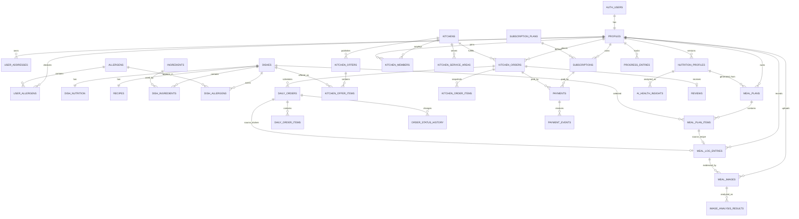

# Thiết kế database — NutriPlan MVP

## 1. Mục tiêu

Database sử dụng **Supabase PostgreSQL**, phục vụ NestJS REST API và Next.js frontend. Thiết kế tập trung vào các quy tắc quan trọng:

- Nutrition Profile được lưu theo phiên bản để không mất lịch sử.
- Recipe chi tiết chỉ được đọc khi subscription còn quyền truy cập.
- NutriPlan Subscription và Kitchen Order là hai giao dịch độc lập.
- Giá, chính sách, địa chỉ, allergen và dinh dưỡng của đơn được snapshot.
- Một Daily Order đã giao chỉ tự động tạo tối đa một Meal Log Entry.
- Ảnh món ăn là dữ liệu riêng tư và kết quả phân tích luôn cần xác nhận.
- NestJS kiểm tra nghiệp vụ; PostgreSQL RLS là lớp bảo vệ dữ liệu cuối cùng.

Migration có thể chạy nằm tại:

`supabase/migrations/202607160001_initial_schema.sql`

## 2. Sơ đồ miền dữ liệu



## 3. Các nhóm bảng

### Người dùng và dinh dưỡng

| Bảng | Vai trò |
|---|---|
| `profiles` | Hồ sơ công khai tối thiểu, role ứng dụng |
| `user_addresses` | Địa chỉ giao hàng đã lưu |
| `nutrition_profiles` | Phiên bản chỉ số cơ thể, mục tiêu và kết quả BMR/TDEE/Macro do backend tính |
| `ai_health_insights` | Insight AI có cấu trúc gắn với đúng phiên bản Nutrition Profile |
| `allergens` | Danh mục allergen chuẩn hóa |
| `user_allergens` | Allergen người dùng khai báo |

`nutrition_profiles` không cập nhật đè phiên bản cũ. Khi tính lại, backend đặt bản hiện tại thành `is_current = false` và tạo bản mới với `version + 1` trong cùng transaction. `formula_code` và `formula_version` giúp truy vết phép tính. AI không ghi đè các số này; mỗi kết quả nằm ở `ai_health_insights` với model, prompt version, input fingerprint và output JSON riêng.

`ai_health_insights` không mở trực tiếp cho client. NestJS dùng server credential để tạo kết quả, kiểm tra JSON Schema và chỉ trả `preview_summary` hoặc output đầy đủ theo quyền subscription. Unique constraint theo hồ sơ/provider/model/prompt/input ngăn retry tạo nhiều lượt tính phí. Input không chứa tên, điện thoại hoặc địa chỉ; kết quả AI không được dùng như chẩn đoán y khoa.

### Danh mục món và Recipe

| Bảng | Vai trò |
|---|---|
| `dishes` | Thông tin món có thể hiển thị trong preview/marketplace |
| `dish_nutrition` | Dinh dưỡng cho một khẩu phần chuẩn |
| `ingredients` | Danh mục nguyên liệu |
| `dish_ingredients` | Định lượng nguyên liệu của món |
| `dish_allergens` | Allergen và nguy cơ lây nhiễm chéo |
| `recipes` | Hướng dẫn chế biến bị khóa bởi subscription |

`dishes.ingredient_summary`, `dish_nutrition` và allergen của món active có thể đọc công khai. Định lượng chuẩn hóa trong `dish_ingredients` và hướng dẫn trong `recipes` chỉ subscriber còn quyền hoặc admin được đọc, tránh làm lộ Recipe qua API preview.

### Kế hoạch và subscription

| Bảng | Vai trò |
|---|---|
| `subscription_plans` | Gói và quyền lợi |
| `subscriptions` | Chu kỳ quyền truy cập của người dùng |
| `meal_plans` | Kế hoạch được sinh từ một phiên bản Nutrition Profile |
| `meal_plan_items` | Món theo ngày và bữa, kèm snapshot dinh dưỡng |

Chỉ có tối đa một subscription mang quyền truy cập (`active` hoặc `cancel_at_period_end`) cho mỗi người dùng. Quyền thực tế còn yêu cầu `current_period_start <= now() < current_period_end`.

### Bếp và đơn hàng

| Bảng | Vai trò |
|---|---|
| `kitchens` | Bếp đối tác |
| `kitchen_members` | Nhân sự được phép thao tác cho bếp |
| `kitchen_service_areas` | Vùng và phí giao |
| `kitchen_offers` | Món lẻ hoặc gói nhiều ngày |
| `kitchen_offer_items` | Món, ngày và bữa thuộc offer |
| `kitchen_orders` | Đơn tổng và tổng tiền |
| `kitchen_order_items` | Snapshot món/gói và đơn giá |
| `daily_orders` | Lịch giao theo ngày/bữa |
| `daily_order_items` | Snapshot món và dinh dưỡng của lần giao |
| `order_status_history` | Audit trạng thái Daily Order |

`kitchen_order_items.item_snapshot`, `kitchen_orders.policy_snapshot` và `allergen_snapshot` giữ nguyên nội dung tại thời điểm thanh toán. Không dựng lại hóa đơn lịch sử từ giá hiện tại trong `kitchen_offers`.

### Thanh toán

| Bảng | Vai trò |
|---|---|
| `payments` | Giao dịch cho đúng một Subscription hoặc Kitchen Order |
| `payment_events` | Webhook gốc và trạng thái xử lý |

Constraint `payments_target_matches_type` không cho một payment liên kết đồng thời với cả subscription và đơn bếp. `idempotency_key` cùng `(provider, provider_event_id)` ngăn xử lý lặp.

### Theo dõi và phân tích

| Bảng | Vai trò |
|---|---|
| `meal_log_entries` | Bữa thực tế và nguồn dữ liệu |
| `meal_images` | Metadata ảnh riêng tư, consent và retention |
| `image_analysis_results` | Một hoặc nhiều gợi ý từ dịch vụ phân tích |
| `ai_health_insights` | Phân tích AI từ Nutrition Profile, có trạng thái xử lý và an toàn |
| `progress_entries` | Cân nặng/vòng eo theo ngày |
| `reviews` | Đánh giá đơn hoàn tất |
| `product_events` | Event đo các giả thuyết H1–H6 |

Partial unique index trên `meal_log_entries.daily_order_id` bảo đảm retry không tạo hai bản ghi tự động cho cùng một Daily Order.

## 4. Luồng transaction bắt buộc trong NestJS

### Tạo Nutrition Profile mới

1. Khóa bản `is_current` hiện tại của user.
2. Đặt bản cũ thành `false`.
3. Tạo bản mới với `version + 1`.
4. Commit toàn bộ hoặc rollback toàn bộ.

### Tạo Kitchen Order

1. Đọc lại offer, món, giá, vùng giao và capacity từ database.
2. Kiểm tra allergen; không tin dữ liệu giá từ frontend.
3. Tạo `kitchen_orders` ở `pending_payment`.
4. Tạo `kitchen_order_items` với snapshot.
5. Tạo payment với `idempotency_key`.
6. Chỉ sau webhook thành công mới chuyển order sang `paid` và tạo `daily_orders`.

### Xử lý webhook thanh toán

1. Xác minh chữ ký nhà cung cấp.
2. Insert `payment_events`; nếu trùng provider event ID thì trả thành công mà không xử lý lại.
3. Khóa payment liên quan.
4. Cập nhật payment và đúng một target: subscription hoặc kitchen order.
5. Commit trong một transaction.

### Chuyển Daily Order sang delivered

1. Kiểm tra state transition hiện tại.
2. Cập nhật `daily_orders` và thêm `order_status_history`.
3. Nếu người mua có subscription còn quyền, tạo một `meal_log_entries` nguồn `kitchen`.
4. Dùng unique index để retry không tạo trùng.

## 5. Ma trận quyền truy cập

| Dữ liệu | Anonymous | Customer | Kitchen staff | Admin/NestJS đặc quyền |
|---|---|---|---|---|
| Món, nutrition, allergen active | Đọc | Đọc | Đọc | Quản lý |
| Recipe | Không | Subscriber đọc | Theo subscription cá nhân | Quản lý |
| Nutrition Profile | Không | Chỉ dữ liệu mình | Chỉ dữ liệu mình | Quản lý khi cần |
| Meal Plan/Meal Log | Không | Chỉ dữ liệu mình | Chỉ dữ liệu mình | Quản lý khi cần |
| Kitchen/Offer active | Đọc | Đọc | Đọc cả dữ liệu bếp mình | Quản lý |
| Kitchen Order | Không | Đơn của mình | Đơn thuộc bếp mình | Quản lý |
| Payment | Không | Chỉ đọc payment mình | Chỉ payment cá nhân | Webhook/quản trị |
| Meal Image | Không | Chỉ ảnh mình | Không | Worker xử lý có kiểm soát |

Các mutation nhạy cảm như giá, payment, trạng thái subscription và trạng thái đơn phải đi qua NestJS service/RPC, không cấp policy ghi trực tiếp cho client.

## 6. Quy ước triển khai

- ID nghiệp vụ dùng UUID; audit/event có thể dùng `bigint identity`.
- Thời gian dùng `timestamptz`, ngày giao/kế hoạch dùng `date`, khung giao dùng `time`.
- Tiền dùng `numeric(12,2)` và luôn có `currency`.
- Macro dùng gram, năng lượng dùng kcal, khối lượng dùng gram/kg/cm theo tên cột.
- Không xóa cứng payment, order hoặc lịch sử trạng thái.
- File thật nằm trong Supabase Storage; database chỉ lưu bucket/path và metadata.
- `service_role` chỉ dùng trong NestJS module server-only cho webhook/job/tác vụ đặc quyền.

## 7. Cách chạy local

```bash
npx supabase init
npx supabase start
npx supabase db reset
npx supabase db lint
npx supabase test db
```

Sinh type cho NestJS sau khi schema thay đổi:

```bash
npx supabase gen types typescript --local \
  > src/backend/src/database/database.types.ts
```

## 8. Các bước tiếp theo

1. Cài Supabase CLI và Docker nếu máy chưa có.
2. Chạy migration bằng `npx supabase db reset`.
3. Thêm database test cho RLS theo customer, kitchen staff và admin.
4. Viết PostgreSQL RPC cho tạo order, payment webhook và state transition.
5. Tạo NestJS Supabase user client/admin client.
6. Sinh TypeScript database type sau mỗi migration.
