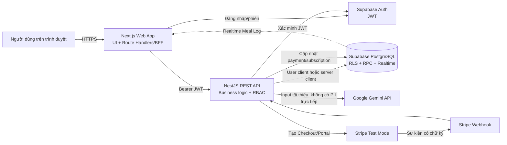
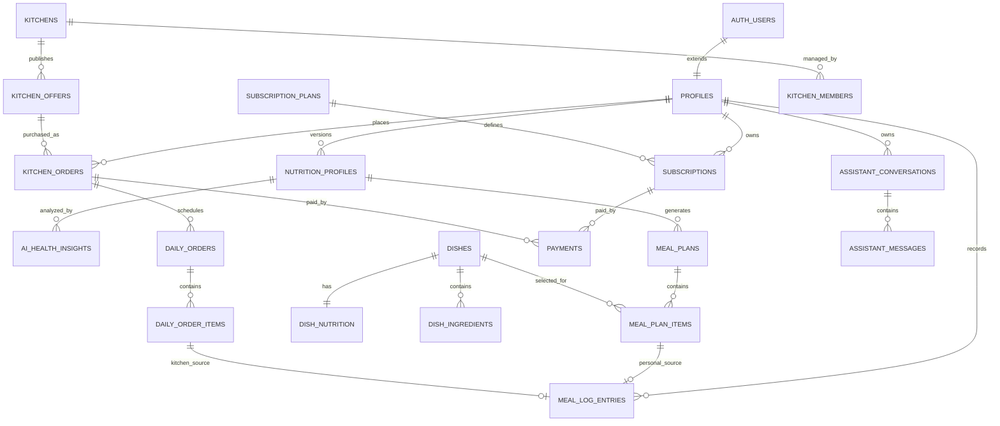
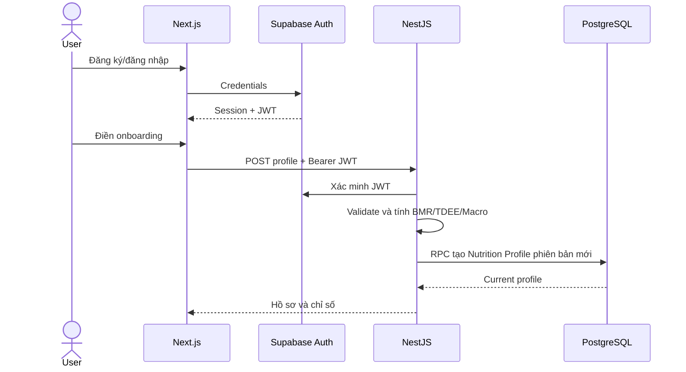
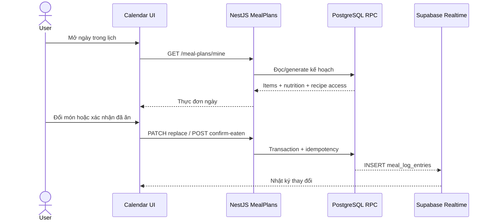
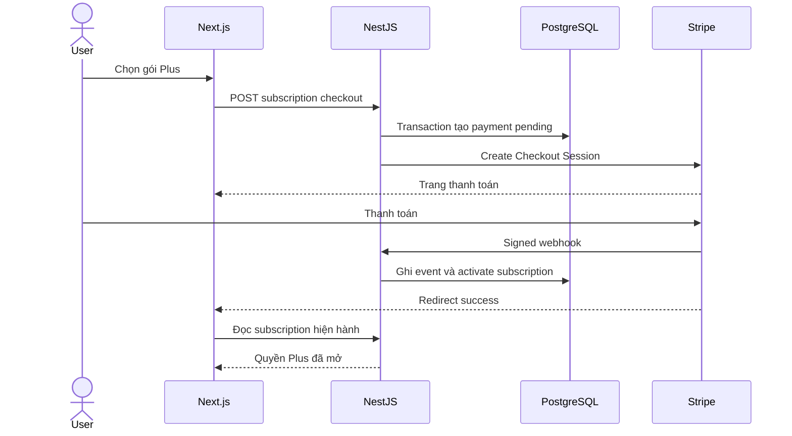

# NutriPlan — Tài liệu thuyết trình kỹ thuật dành cho CTO

> Phạm vi: kiến trúc, công nghệ, cấu trúc dữ liệu, bảo mật và các luồng hoạt động chính của phiên bản MVP hiện tại.
>
> Cập nhật theo source code và migrations tại ngày 07/08/2026.

## 1. Tóm tắt kỹ thuật trong 30 giây

NutriPlan là nền tảng dinh dưỡng gồm ba nhóm người dùng: **khách hàng**, **bếp đối tác** và **quản trị viên**. Hệ thống kết hợp dữ liệu cơ thể, mục tiêu, mức vận động và nhật ký ăn uống để tính nhu cầu dinh dưỡng, xây dựng thực đơn cá nhân, tạo AI Insight và kết nối người dùng với các gói ăn của bếp.

Kiến trúc hiện tại gồm:

- **Next.js + TypeScript** cho giao diện web và lớp Backend-for-Frontend (BFF).
- **NestJS + TypeScript** cho REST API, nghiệp vụ, phân quyền và tích hợp bên thứ ba.
- **Supabase** cho Authentication, PostgreSQL, Row Level Security và Realtime.
- **Gemini API** cho AI Health Insight và trợ lý dinh dưỡng.
- **Stripe Test Mode** cho subscription, checkout, webhook và Customer Portal.
- **Vercel** triển khai độc lập frontend và backend.

Điểm quan trọng của thiết kế là: **các chỉ số BMR/TDEE/Macro được backend tính bằng công thức xác định; AI chỉ diễn giải và đưa insight, không tự tạo hoặc thay đổi số liệu sức khỏe gốc**.

## 2. Kiến trúc tổng thể



### Vì sao tách frontend và backend?

- Next.js tập trung vào trải nghiệm, render và điều phối request từ trình duyệt.
- NestJS là ranh giới nghiệp vụ duy nhất cho các thao tác nhạy cảm: AI, thanh toán, quyền subscription, thay món, xác nhận đã ăn, trạng thái đơn và quản trị.
- Supabase Secret Key, Gemini API Key và Stripe Secret Key chỉ tồn tại ở backend.
- Có thể mở rộng mobile app sau này mà vẫn dùng chung REST API.

## 3. Công nghệ đang sử dụng

| Lớp | Công nghệ | Vai trò trong hệ thống |
|---|---|---|
| Frontend | Next.js 14, React 18, TypeScript 5 | App Router, UI, routing, SSR và Route Handlers làm BFF |
| UI | CSS hiện tại, Lucide React | Giao diện responsive và hệ thống icon |
| Backend | NestJS 11, TypeScript 5 | REST API dạng module, dependency injection và business logic |
| API contract | DTO, `class-validator`, `class-transformer`, Swagger | Validate đầu vào, loại field thừa và cung cấp API docs |
| Validation AI | Zod | Kiểm tra input/output có cấu trúc trước và sau khi gọi AI |
| Database | Supabase PostgreSQL | Dữ liệu quan hệ, constraint, transaction, function/RPC và index |
| Authentication | Supabase Auth + JWT | Đăng ký, đăng nhập, session và định danh người dùng |
| Authorization | NestJS Guards + PostgreSQL RLS | RBAC ở API và ownership ở tầng dữ liệu |
| Realtime | Supabase Realtime | Đồng bộ nhật ký dinh dưỡng khi có bản ghi mới |
| AI | Google Gemini REST API | Health Insight và trợ lý hội thoại có ngữ cảnh |
| Thanh toán | Stripe Checkout, Webhook, Customer Portal | Bán subscription, tự động gia hạn, hủy và quản lý thẻ |
| Kiểm thử | Jest, ts-jest | Unit test service, guard, lỗi provider và tính idempotent |
| Triển khai | Vercel | Frontend và NestJS backend triển khai thành hai project độc lập |
| Quản lý mã nguồn | Git/GitHub | Version control và kích hoạt deployment theo commit |

### Cấu trúc source code

```text
nutriplan/
├── src/
│   ├── frontend/
│   │   ├── app/                 # Next.js routes và Route Handlers
│   │   ├── components/          # Layout/component dùng chung
│   │   ├── features/            # Dashboard, meal plan, journal, kitchen...
│   │   └── lib/                 # Supabase client và backend proxy
│   └── backend/
│       └── src/
│           ├── common/          # Guard, decorator, auth interfaces
│           ├── config/          # Validate biến môi trường
│           ├── database/        # Supabase public/admin/user client
│           └── modules/         # Các module nghiệp vụ NestJS
├── supabase/
│   ├── migrations/              # Lịch sử schema và database functions
│   └── seed.sql                 # Dữ liệu mẫu
└── docs/                        # Tài liệu kỹ thuật và vận hành
```

Backend được chia theo miền nghiệp vụ: `auth`, `profiles`, `nutrition`, `wellness`, `ai-insights`, `assistant`, `subscriptions`, `payments`, `catalog`, `meal-plans`, `kitchens`, `orders`, `admin` và `settings`. Cách chia này tránh một service quá lớn và cho phép mỗi module có controller, service, DTO và test riêng.

## 4. Cấu trúc database

Database được thiết kế theo mô hình quan hệ và chia thành sáu miền chính.

### 4.1. Người dùng, hồ sơ và sức khỏe

| Bảng | Chức năng |
|---|---|
| `auth.users` | Tài khoản do Supabase Auth quản lý |
| `profiles` | Thông tin ứng dụng tối thiểu và role: `customer`, `kitchen_staff`, `admin` |
| `user_addresses` | Địa chỉ giao hàng của người dùng |
| `nutrition_profiles` | Phiên bản hồ sơ dinh dưỡng, mục tiêu và các chỉ số đã tính |
| `progress_entries` | Cân nặng và số đo theo ngày để tạo biểu đồ xu hướng |
| `daily_wellness_checkins` | Check-in hằng ngày: vận động, giấc ngủ, nước uống, mệt mỏi... |
| `user_settings` | Tên trợ lý, thiết lập cá nhân và tùy chọn người dùng |
| `allergens`, `user_allergens` | Danh mục dị ứng chuẩn hóa và quan hệ với người dùng |

`nutrition_profiles` dùng mô hình **versioning**: khi người dùng cập nhật số đo, bản cũ không bị ghi đè mà chuyển `is_current = false`; bản mới được tạo với `version + 1`. Nhờ đó hệ thống biết một thực đơn hoặc AI Insight đã được tạo từ bộ số liệu nào.

### 4.2. Danh mục món ăn

| Bảng | Chức năng |
|---|---|
| `dishes` | Thông tin chung, ảnh và mô tả món |
| `dish_nutrition` | Calo, macro, chất xơ, natri, cholesterol, khoáng chất và vitamin |
| `ingredients` | Danh mục nguyên liệu |
| `dish_ingredients` | Nguyên liệu và định lượng của từng món |
| `dish_allergens` | Dị ứng và nguy cơ lây nhiễm chéo |
| `recipes` | Cách chế biến; quyền xem chi tiết phụ thuộc subscription |

### 4.3. Thực đơn cá nhân và nhật ký

| Bảng | Chức năng |
|---|---|
| `meal_plans` | Kế hoạch gắn với một user và một phiên bản Nutrition Profile |
| `meal_plan_items` | Món theo ngày, bữa sáng/trưa/tối/phụ/đồ uống và snapshot dinh dưỡng |
| `meal_plan_item_replacements` | Lịch sử đổi món và món thay thế |
| `meal_log_entries` | Những món người dùng thực sự xác nhận đã ăn |
| `meal_images` | Metadata ảnh món ăn người dùng tải lên |
| `image_analysis_results` | Kết quả phân tích ảnh và trạng thái xác nhận |

Việc tách `meal_plan_items` và `meal_log_entries` phản ánh hai khái niệm khác nhau: **kế hoạch dự kiến** và **hành vi thực tế**. Chỉ khi người dùng bấm “Đã ăn”, hệ thống mới ghi vào nhật ký.

### 4.4. Bếp đối tác và fulfillment

| Bảng | Chức năng |
|---|---|
| `kitchens` | Hồ sơ và trạng thái hoạt động của bếp |
| `kitchen_members` | User nào được quản lý bếp, với role owner/manager/staff |
| `kitchen_service_areas` | Khu vực và phí giao hàng |
| `kitchen_offers` | Gói lẻ, 7, 30 hoặc 120 ngày |
| `kitchen_offer_items` | Món/ngày/bữa cấu thành gói |
| `kitchen_offer_reviews` | Đánh giá và bình luận cho gói |
| `kitchen_orders` | Đơn tổng người dùng mua từ bếp |
| `kitchen_order_items` | Snapshot gói và đơn giá lúc đặt |
| `daily_orders` | Tách đơn gói thành lịch chuẩn bị/giao từng ngày |
| `daily_order_items` | Các món bếp chuẩn bị trong mỗi ngày, gồm snapshot nguyên liệu/dinh dưỡng |
| `order_status_history` | Audit toàn bộ thay đổi trạng thái |
| `kitchen_meal_change_requests` | Yêu cầu đổi món của khách trước khi bếp chuẩn bị |

Giá, dinh dưỡng, nguyên liệu, dị ứng và chính sách được **snapshot tại thời điểm đặt**. Vì vậy dữ liệu lịch sử không bị thay đổi khi bếp sửa gói sau này.

### 4.5. Subscription và thanh toán

| Bảng | Chức năng |
|---|---|
| `subscription_plans` | Giá, chu kỳ 7 ngày/1 tháng/3 tháng và quyền lợi |
| `subscriptions` | Chu kỳ sử dụng, provider và trạng thái gia hạn/hủy |
| `billing_customers` | Liên kết user nội bộ với Stripe Customer |
| `payments` | Giao dịch subscription hoặc kitchen order |
| `payment_events` | Webhook gốc để audit và chống xử lý lặp |

Một `payment` chỉ được phép liên kết với **một** loại đối tượng: subscription hoặc kitchen order. Các unique constraint trên `idempotency_key` và `(provider, provider_event_id)` ngăn thanh toán/webhook bị xử lý hai lần.

### 4.6. AI, hội thoại và analytics

| Bảng | Chức năng |
|---|---|
| `ai_health_insights` | Input tối thiểu, fingerprint, provider/model/prompt/formula version và output JSON |
| `assistant_conversations` | Cuộc trò chuyện của từng user |
| `assistant_messages` | Tin nhắn user/assistant, model và token usage |
| `reviews` | Đánh giá đơn bếp hoàn tất |
| `product_events` | Event sản phẩm phục vụ phân tích funnel |

### 4.7. Quan hệ dữ liệu cốt lõi



## 5. Công thức dinh dưỡng và nguyên tắc AI

### 5.1. BMR — Mifflin–St Jeor

```text
BMR = 10 × cân nặng (kg) + 6,25 × chiều cao (cm) - 5 × tuổi + S
S = 5 đối với nam; -161 đối với các lựa chọn giới tính còn lại trong MVP
```

### 5.2. TDEE

```text
TDEE = BMR × hệ số vận động
```

| Mức vận động | Hệ số |
|---|---:|
| Ít vận động | 1,2 |
| Nhẹ | 1,375 |
| Vừa | 1,55 |
| Cao | 1,725 |
| Rất cao | 1,9 |

### 5.3. Mục tiêu calorie và macro

- Hệ thống ước lượng thay đổi năng lượng bằng `chênh lệch cân nặng × 7.700 kcal / số ngày`.
- Giảm cân được giới hạn trong khoảng thâm hụt 200–750 kcal/ngày.
- Tăng cơ được giới hạn trong khoảng dư 150–500 kcal/ngày.
- Duy trì không điều chỉnh TDEE.
- Mức calorie mục tiêu tối thiểu trong MVP là 1.200 kcal/ngày.
- Protein: `1,8 g/kg`; mục tiêu tăng cơ: `2 g/kg`.
- Chất béo chiếm 27% calorie mục tiêu.
- Tinh bột nhận phần calorie còn lại, với 4 kcal/g protein, 4 kcal/g carbohydrate và 9 kcal/g fat.

Mỗi kết quả lưu `formula_code` và `formula_version`, hiện tại là `mifflin_st_jeor` và `mifflin-st-jeor-goal-pace-v2`, giúp audit khi công thức thay đổi.

### 5.4. Vai trò của AI

AI nhận dữ liệu đã validate như tuổi, chiều cao, cân nặng, mục tiêu, BMR/TDEE/Macro, sở thích, dị ứng và check-in trong ngày. AI có nhiệm vụ:

- Diễn giải dữ liệu thành insight dễ hiểu.
- Nhận xét ngắn về vận động, giấc ngủ, nước uống và cảm giác mệt mỏi.
- Đưa ra hành động thực tế trong phạm vi dinh dưỡng/lối sống.
- Đánh dấu trường hợp nên tham khảo chuyên gia.

AI không được dùng để chẩn đoán bệnh. Input gửi provider loại bỏ tên, email, số điện thoại và địa chỉ. Kết quả được kiểm tra schema trước khi lưu.

## 6. Các luồng hoạt động chính

### 6.1. Đăng ký, đăng nhập và onboarding lần đầu

1. Người dùng vào landing page, sau đó chọn đăng ký hoặc đăng nhập.
2. Supabase Auth tạo/xác thực tài khoản và phát JWT.
3. Trigger database tạo `profiles` tương ứng với `auth.users`.
4. Next.js giữ session bằng Supabase SSR cookie.
5. Sau lần đăng nhập đầu, frontend yêu cầu nhập số đo, mục tiêu, vận động, sở thích, dị ứng và món không ăn được.
6. NestJS validate DTO, tính BMR/TDEE/Macro và gọi RPC tạo phiên bản `nutrition_profiles` mới.
7. Profile hiện hành trở thành đầu vào cho dashboard, thực đơn và AI Insight.
8. Sau 7 ngày, UI nhắc người dùng cập nhật số đo/check-in để dữ liệu phản ánh hiện trạng mới.



### 6.2. AI Health Insight

1. Người dùng hoàn tất check-in trong ngày.
2. Backend lấy Nutrition Profile hiện hành và Daily Wellness Check-in.
3. Backend tạo input tối thiểu, validate bằng Zod và băm thành `input_fingerprint`.
4. Nếu fingerprint đã có kết quả hoàn tất, hệ thống trả cache thay vì gọi Gemini lần nữa.
5. Nếu chưa có, backend lưu trạng thái `processing`, gọi Gemini với pseudonymous user hash.
6. Output được kiểm tra schema, gắn safety status rồi lưu cùng model/prompt/formula version.
7. User miễn phí nhận phần preview; user có quyền Plus nhận output đầy đủ.
8. Frontend hiển thị loading và polling khi kết quả đang xử lý.

Thiết kế fingerprint + unique constraint giúp retry hoặc double-click không tạo nhiều lần gọi AI có cùng đầu vào.

### 6.3. Thực đơn cá nhân và nhật ký dinh dưỡng

1. Backend đọc Nutrition Profile hiện hành và quyền Plus.
2. Database function tạo/lấy kế hoạch hiện hành; advisory lock ngăn hai request sinh trùng kế hoạch.
3. Hệ thống chọn món theo mục tiêu calorie/macro, sở thích và giới hạn dị ứng.
4. Người dùng xem lịch theo ngày, bao gồm bữa chính, bữa phụ và đồ uống.
5. Khi đổi món, backend chỉ trả các ứng viên vẫn nằm trong miền dinh dưỡng cho phép.
6. Khi bấm “Đã ăn”, RPC cập nhật trạng thái item và tạo đúng một `meal_log_entries`.
7. Realtime thông báo frontend tải lại nhật ký và tổng dinh dưỡng trong ngày.



### 6.4. Mua và sử dụng gói của bếp

1. Người dùng lọc bếp theo khu vực và loại gói, xem món, dinh dưỡng, nguyên liệu, đánh giá.
2. Backend đọc lại offer và giá từ database; không tin giá do frontend gửi.
3. Đơn tổng `kitchen_orders` được tạo cùng snapshot gói, dị ứng và nhu cầu ăn của khách.
4. Gói nhiều ngày được tách thành `daily_orders` và `daily_order_items` để bếp quản lý từng ngày/từng món.
5. Bếp chỉ nhìn thấy đơn thuộc bếp mà tài khoản là thành viên.
6. Trạng thái đi theo state machine: đã lên lịch → đang chuẩn bị → đã giao.
7. Khách có thể yêu cầu đổi món trước khi bếp bắt đầu chuẩn bị.
8. Sau khi đã giao, khách bấm “Đã ăn”; món và snapshot dinh dưỡng được ghi vào Meal Log.

Lưu ý hiện trạng: luồng tạo lịch đơn bếp đang phục vụ **MVP/demo**. Trước khi thu tiền thật cho đơn bếp cần kết nối payment provider, webhook và đối soát tương tự subscription.

### 6.5. Subscription, tự động gia hạn và hủy gói

1. Người dùng có thể kích hoạt một lần dùng thử nội bộ 7 ngày.
2. Khi mua Plus, NestJS gọi RPC `create_subscription_checkout` để tạo subscription/payment ở trạng thái chờ, có idempotency key.
3. Backend tạo Stripe Checkout Session ở `mode=subscription` và chuyển trình duyệt sang Stripe.
4. Stripe gửi webhook có chữ ký về backend.
5. Backend ghi `payment_events`, xử lý idempotent rồi kích hoạt subscription trong database.
6. Stripe tự động gia hạn theo chu kỳ của plan; webhook cập nhật chu kỳ mới.
7. Trong Cài đặt, Customer Portal cho phép cập nhật phương thức thanh toán, hủy cuối kỳ hoặc bật lại gia hạn.
8. Quyền Plus được xác định từ trạng thái và `current_period_end`, không chỉ từ nhãn gói trên frontend.



### 6.6. Trợ lý ảo

1. Widget chat được gắn toàn cục ở góc phải các trang trong ứng dụng.
2. Backend tải tối đa 16 tin nhắn gần nhất, Nutrition Profile hiện hành, tổng dinh dưỡng đã ăn hôm nay và AI Insight gần nhất.
3. Gemini tạo phản hồi theo ngữ cảnh, nhưng bị giới hạn trong vai trò hỗ trợ dinh dưỡng.
4. Tin nhắn user và assistant được lưu cùng conversation, provider, model và token usage.
5. Mọi truy vấn conversation đều kèm `user_id` để không đọc hội thoại người khác.

### 6.7. Quản lý bếp và quản trị hệ thống

- `kitchen_staff` xem khách hàng, dị ứng, chế độ ăn, gói đang hoạt động, lịch 7/30/120 ngày và cập nhật món/trạng thái cho **bếp được phân quyền**.
- `admin` xem số người dùng, số bếp, doanh thu, trạng thái bếp, cơ cấu subscription, trial conversion và churn.
- Admin có thể chuyển bếp giữa `pending`, `active`, `suspended`, `closed`.
- Cả controller và service/database đều kiểm tra scope; việc chỉ ẩn menu trên frontend không được xem là phân quyền.

## 7. Xác thực, phân quyền và bảo mật

### 7.1. Hai lớp bảo vệ

1. **NestJS Global Guards**
   - `SupabaseAuthGuard` kiểm tra Bearer JWT bằng Supabase Auth.
   - Guard tải role từ `profiles` và gắn user đã xác thực vào request.
   - `RolesGuard` kiểm tra decorator `@Roles(...)` cho API bếp/admin.

2. **PostgreSQL Row Level Security**
   - Customer chỉ truy cập dữ liệu có `user_id = auth.uid()`.
   - Kitchen staff chỉ truy cập dữ liệu thuộc bếp có membership.
   - Các mutation payment, subscription và state transition đi qua backend/RPC đặc quyền.

### 7.2. Lớp BFF của Next.js

Trình duyệt không gọi trực tiếp các API nhạy cảm bằng secret. Route Handler của Next.js lấy session server-side, chuyển tiếp JWT tới NestJS và trả response với `Cache-Control: private, no-store`. Cách này giảm lộ cấu hình backend và tạo một điểm chung để xử lý lỗi 401/503.

### 7.3. Các kiểm soát khác

- Global validation dùng `whitelist` và `forbidNonWhitelisted`; field không có trong DTO sẽ bị từ chối.
- CORS chỉ cho phép danh sách domain cấu hình.
- Biến môi trường production được validate ngay khi backend khởi động.
- Raw request body được giữ riêng cho bước xác minh chữ ký Stripe webhook.
- Không log tên, email, điện thoại hoặc địa chỉ trong prompt AI.
- Snapshot và audit history bảo vệ tính toàn vẹn của đơn hàng lịch sử.
- Unique constraint, transaction và idempotency key chống double-submit.

## 8. Tính nhất quán và khả năng phục hồi

| Rủi ro | Cơ chế hiện tại |
|---|---|
| Double-click thanh toán | Idempotency key ở application và database |
| Stripe gửi webhook lặp | Unique provider event ID trong `payment_events` |
| Hai request sinh thực đơn cùng lúc | PostgreSQL advisory lock và RPC transaction |
| Xác nhận “Đã ăn” nhiều lần | Unique source/reference và function idempotent |
| Sửa giá/gói làm sai đơn cũ | Snapshot dữ liệu tại thời điểm đặt |
| AI timeout/output sai | Timeout, schema validation, trạng thái failed và retry có kiểm soát |
| Cập nhật hồ sơ làm mất lịch sử | Nutrition Profile versioning |
| Frontend gửi field/giá giả | Backend whitelist DTO và đọc lại dữ liệu chuẩn từ DB |

Health endpoint kiểm tra API và kết nối database. Swagger được cung cấp tại `/api/docs` để kiểm thử contract với Bearer token.

## 9. Triển khai hiện tại

```text
Frontend: Vercel project → Next.js
Backend:  Vercel project → NestJS serverless API
Database/Auth/Realtime: Supabase cloud project
AI: Google Gemini API
Payment subscription: Stripe Test Mode
```

Các biến môi trường quan trọng:

- Frontend: `NUTRIPLAN_API_BASE_URL`, Supabase URL và publishable key.
- Backend: Supabase URL/publishable/secret key, `GEMINI_API_KEY`, `GEMINI_MODEL`, Stripe secret/webhook secret, `FRONTEND_URL`, `CORS_ORIGIN`.
- Secret key không có tiền tố `NEXT_PUBLIC_` và không được commit vào Git.

Frontend và backend được deploy riêng để có thể scale, rollback và theo dõi lỗi độc lập. Migrations là nguồn sự thật của schema; mọi thay đổi database phải tạo migration mới thay vì sửa trực tiếp production.

## 10. Mức độ hoàn thiện hiện tại

### Đã có luồng kỹ thuật hoàn chỉnh trong MVP

- Auth/session bằng Supabase.
- Onboarding, hồ sơ dinh dưỡng có phiên bản và công thức BMR/TDEE/Macro.
- Daily wellness check-in và AI Health Insight bằng Gemini.
- Trợ lý ảo có lịch sử hội thoại và ngữ cảnh dinh dưỡng.
- Thực đơn cá nhân, đổi món, xác nhận đã ăn và Meal Log.
- Marketplace bếp, gói ăn, lịch fulfillment và dashboard từng bếp.
- Phân quyền customer/kitchen staff/admin.
- Subscription Stripe Test Mode, webhook, gia hạn/hủy và Customer Portal.
- Dashboard admin về user, bếp và subscription.

### Đang ở mức MVP hoặc cần hoàn thiện trước production thương mại

- Thanh toán đơn bếp hiện vẫn là luồng demo/mock.
- Phân tích ảnh có schema dữ liệu nhưng chưa phải một pipeline AI production hoàn chỉnh.
- Monitoring hiện chủ yếu dựa vào health endpoint và log nền tảng; cần error tracking, tracing và alert.
- Cần kiểm thử tải, backup/restore drill và kế hoạch disaster recovery.
- Cần security review độc lập trước khi xử lý dữ liệu sức khỏe và tiền thật ở quy mô lớn.

## 11. Technical debt và roadmap ưu tiên

### P0 — trước khi mở production thật

1. Chạy Supabase Security/Performance Advisor và xử lý toàn bộ cảnh báo RLS, quyền `EXECUTE` của helper function và foreign key thiếu index.
2. Bật leaked-password protection; bắt buộc MFA cho admin và kitchen owner.
3. Hoàn thiện payment thật cho kitchen order, refund, reconciliation và payout.
4. Thêm error tracking, structured logs, correlation ID và cảnh báo webhook thất bại.
5. Thêm integration/E2E test cho auth → subscription → entitlement và kitchen order → fulfillment → Meal Log.

### P1 — sau khi có người dùng thật

1. Sinh TypeScript database types tự động từ Supabase schema.
2. Tách AI generation dài thành background job/queue để tránh timeout serverless.
3. Thêm rate limit và quota cho AI/chat theo gói.
4. Đo conversion, retention và cost per AI generation từ `product_events`.
5. Thiết lập retention/xóa dữ liệu, consent và quy trình export tài khoản.

### P2 — khi cần mở rộng

1. Cache catalog và kitchen offer ít thay đổi.
2. Tách image-analysis worker khỏi API đồng bộ.
3. Mở REST API dùng chung cho mobile app.
4. Xây recommendation engine có evaluation dataset và theo dõi chất lượng phiên bản.

## 12. Kịch bản thuyết trình CTO 8–10 phút

### Slide 1 — Bài toán và giải pháp

“NutriPlan biến dữ liệu cơ thể và hành vi hằng ngày thành ba đầu ra: chỉ số dinh dưỡng có thể kiểm chứng, thực đơn có thể hành động và kết nối bếp để thực thi kế hoạch.”

### Slide 2 — Kiến trúc

Trình bày sơ đồ Next.js → NestJS → Supabase, cùng hai tích hợp Gemini và Stripe. Nhấn mạnh secret nằm ở backend và kiến trúc cho phép tái sử dụng API cho mobile.

### Slide 3 — Data model

Giới thiệu sáu miền dữ liệu. Nhấn mạnh Nutrition Profile versioning, order snapshot và việc tách planned meal khỏi consumed meal.

### Slide 4 — Calculation before AI

Trình bày Mifflin–St Jeor, activity factor và macro. Thông điệp chính: “AI không thay thế công thức; AI diễn giải kết quả đã được hệ thống tính và validate.”

### Slide 5 — Hai luồng tạo doanh thu

- B2C subscription mở khóa recipe, thực đơn và insight đầy đủ.
- Marketplace bếp bán gói ăn mà không bắt buộc subscription; subscriber nhận thêm tracking và phân tích.

### Slide 6 — Security và data integrity

Nêu JWT, RBAC, RLS, transaction, idempotency, webhook signature và snapshot. Đây là phần thể hiện vai trò CTO rõ nhất.

### Slide 7 — Khả năng vận hành

Frontend/backend deploy độc lập trên Vercel, database managed bởi Supabase, API docs bằng Swagger, test bằng Jest và migrations quản lý schema.

### Slide 8 — Thực trạng và roadmap

Nói rõ subscription đang ở Stripe Test Mode, kitchen payment còn mock, monitoring/security hardening là P0. Việc minh bạch giới hạn giúp kế hoạch kỹ thuật đáng tin hơn.

## 13. Câu hỏi kỹ thuật thường gặp

**Tại sao không để frontend gọi thẳng Supabase cho mọi thao tác?**  
Các thao tác nhạy cảm cần một ranh giới nghiệp vụ duy nhất. NestJS kiểm tra quyền, giá, state transition và gọi dịch vụ bên thứ ba; RLS vẫn là lớp bảo vệ cuối.

**Tại sao cần Nutrition Profile versioning?**  
Nếu cân nặng hoặc mục tiêu thay đổi, hệ thống vẫn truy vết được thực đơn và insight cũ đã dựa trên dữ liệu nào.

**Làm sao tránh AI đưa ra số liệu sai?**  
BMR/TDEE/Macro do code xác định. Input/output AI có schema, lưu phiên bản, fingerprint và safety status; AI chỉ diễn giải.

**Làm sao tránh thanh toán hoặc nhật ký bị ghi trùng?**  
Idempotency key, unique constraint và transaction được thực thi ngay trong PostgreSQL, không chỉ dựa vào trạng thái giao diện.

**Hệ thống có scale được không?**  
Các lớp triển khai độc lập và database managed phù hợp giai đoạn MVP. Khi lượng AI/image job tăng, bước mở rộng chính là queue/worker, caching, rate limit và observability thay vì viết lại toàn bộ hệ thống.

## 14. Tài liệu liên quan

- Thiết kế database chi tiết: [`docs/database-design.md`](./database-design.md)
- Hướng dẫn Stripe Test Mode: [`docs/stripe-test-mode.md`](./stripe-test-mode.md)
- Migration database: [`supabase/migrations`](../supabase/migrations)
- Backend modules: [`src/backend/src/modules`](../src/backend/src/modules)
- Frontend features: [`src/frontend/features`](../src/frontend/features)
- Supabase Auth: <https://supabase.com/docs/guides/auth>
- Supabase Row Level Security: <https://supabase.com/docs/guides/database/postgres/row-level-security>
- Next.js App Router: <https://nextjs.org/docs/app>
- NestJS Documentation: <https://docs.nestjs.com/>
- Stripe Subscriptions: <https://docs.stripe.com/billing/subscriptions/overview>

