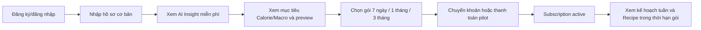
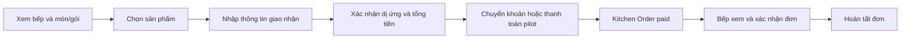

# Kế hoạch phát triển NutriPlan trong 3 tuần — Nhóm 2 người

## 1. Mục tiêu duy nhất

Trong 3 tuần, hoàn thành một bản MVP có thể kiểm chứng và tạo doanh thu từ hai luồng:

1. **NutriPlan Subscription:** người dùng xem preview miễn phí, chọn gói 7 ngày, 1 tháng hoặc 3 tháng để mở thực đơn và Recipe chi tiết.
2. **Kitchen Order:** người dùng mua món hoặc gói của một bếp đối tác mà không cần subscription.

Giá trị dẫn người dùng tới hai luồng doanh thu là **AI Health Insights**: NestJS tính các chỉ số dinh dưỡng bằng công thức cố định, sau đó AI giải thích dữ liệu, nêu điểm đáng chú ý và đề xuất hành động phù hợp với mục tiêu của khách hàng.

Thời gian thực hiện dự kiến:

```text
20/07/2026 → 09/08/2026
```

Kế hoạch giả định hai thành viên làm khoảng 35–40 giờ/người/tuần. Với chỉ 3 tuần, nhóm không xây sản phẩm hoàn chỉnh mà tập trung tạo hai giao dịch thật, thu phản hồi và đo tỷ lệ chuyển đổi.

## 2. Hai hành trình phải hoàn thành

### Luồng A — Bán Subscription



### Luồng B — Bán món từ bếp



Hai luồng phải độc lập. Mua món bếp không được tự thêm subscription; mua subscription không được tự tạo đơn bếp.

## 3. Phạm vi bắt buộc

### 3.1 Nền tảng tối thiểu

- Next.js frontend, NestJS backend và Supabase PostgreSQL/Auth.
- Đăng ký, đăng nhập và đăng xuất.
- Hai role: `customer` và `kitchen_staff`.
- RLS để user chỉ thấy dữ liệu của mình và bếp chỉ thấy đơn của bếp mình.
- Deploy frontend, backend và database lên môi trường production/pilot.

### 3.2 AI Health Insights — Giá trị cốt lõi thu hút khách hàng

- NestJS kiểm tra dữ liệu và tính BMR, TDEE, mục tiêu Calorie và Macro bằng công thức có mã phiên bản; không giao phép tính quyết định cho mô hình AI.
- AI chỉ nhận dữ liệu đã chuẩn hóa và tối thiểu: tuổi, giới tính, chiều cao, cân nặng, mức vận động, mục tiêu, dị ứng/hạn chế ăn uống và các kết quả đã tính.
- AI trả kết quả có cấu trúc gồm: tóm tắt, quan sát kèm bằng chứng từ dữ liệu, gợi ý hành động, câu hỏi còn thiếu, giới hạn và cờ an toàn.
- Insight miễn phí chỉ hiển thị một tóm tắt ngắn để người dùng thấy giá trị; subscriber mở toàn bộ phân tích và được tạo lại khi hồ sơ thay đổi.
- Kết quả không tự sửa Nutrition Profile, mục tiêu Calorie/Macro hoặc Meal Plan. Người dùng phải xác nhận mọi thay đổi.
- Mỗi kết quả lưu `model`, `prompt_version`, `formula_version`, dữ liệu đầu vào đã rút gọn, đầu ra có cấu trúc, trạng thái an toàn và thời điểm tạo để audit.
- Cùng một phiên bản hồ sơ chỉ tạo một insight; retry dùng idempotency key và kết quả có thể cache để kiểm soát chi phí.

AI không được chẩn đoán bệnh, dự đoán nguy cơ bệnh, kê thuốc, đề xuất điều trị hoặc khẳng định một thực đơn an toàn cho bệnh lý. Nếu dữ liệu thiếu, mâu thuẫn hoặc có dấu hiệu cần chuyên môn, AI phải nói rõ giới hạn và khuyến nghị người dùng trao đổi với chuyên gia phù hợp.

Đầu ra MVP:

```json
{
  "summary": "string",
  "observations": [{ "title": "string", "evidence": "string", "confidence": "low|medium|high" }],
  "actionable_suggestions": ["string"],
  "questions_for_user": ["string"],
  "limitations": ["string"],
  "safety_flags": ["string"],
  "recommend_professional_review": false
}
```

Backend gọi OpenAI qua Responses API và ép đầu ra theo JSON Schema/Structured Outputs. MVP ưu tiên model cân bằng chi phí; model ID nằm trong biến môi trường để có thể thay đổi sau khi chạy bộ đánh giá, không hard-code vào nghiệp vụ. [OpenAI — Models](https://developers.openai.com/api/docs/models).

API MVP chỉ cần hai endpoint:

- `POST /api/v1/ai-health-insights`: tạo hoặc trả lại kết quả đã cache cho Nutrition Profile hiện hành; giới hạn tần suất theo user và subscription.
- `GET /api/v1/ai-health-insights/latest`: trả `preview_summary` cho user miễn phí hoặc toàn bộ output cho subscriber.

`OPENAI_API_KEY` chỉ tồn tại ở backend, không dùng biến `NEXT_PUBLIC_*`. Trước pilot, nhóm chuẩn bị 15–20 ca đánh giá gồm dữ liệu bình thường, dữ liệu thiếu/mâu thuẫn, mục tiêu cực đoan và nội dung có dấu hiệu cần chuyên gia; chỉ phát hành khi output đúng schema và không vượt ranh giới an toàn.

### 3.3 Subscription tạo doanh thu

- Form hồ sơ tối giản: giới tính, tuổi, chiều cao, cân nặng, mức vận động, mục tiêu và dị ứng.
- Tính BMR/TDEE/Calorie/Macro bằng một công thức cố định.
- Preview miễn phí một ngày, không trả Recipe hoặc định lượng chi tiết.
- Ba gói subscription: 7 ngày, 1 tháng và 3 tháng.
- Mỗi gói có giá, thời hạn và mã plan riêng; backend lấy giá từ database.
- Thực đơn vẫn được tổ chức theo chu kỳ 7 ngày và làm mới hằng tuần trong thời hạn subscription.
- Trang quyền lợi, giá, hướng dẫn thanh toán và trạng thái chờ xác nhận.
- Xác nhận thanh toán thủ công có audit hoặc dùng sandbox nếu chưa thể nhận tiền thật.
- Subscription `active` mở thực đơn tuần hiện tại, nguyên liệu và cách làm trong suốt thời hạn gói.
- Subscription hết hạn hoặc chưa thanh toán không đọc được Recipe từ API.

### 3.4 Kitchen Order tạo doanh thu

- Một bếp đối tác.
- 3–5 món lẻ và tối đa một gói 5 ngày.
- Hiển thị giá, Calorie/Macro, allergen, khu vực và thời gian giao.
- Form người nhận, điện thoại, địa chỉ, giờ giao và ghi chú dị ứng.
- Server tính lại tổng tiền, không tin giá từ frontend.
- Thanh toán/chuyển khoản độc lập với subscription.
- Kitchen Order lưu snapshot giá, món, chính sách và thông tin giao.
- Dashboard bếp tối giản: xem đơn, xem cảnh báo allergen, xác nhận và hoàn tất.
- Trạng thái tối giản: `pending_payment → paid → confirmed → completed`, thêm `cancelled` khi cần.

## 4. Những phần cắt khỏi kế hoạch 3 tuần

- Meal Scan và phân tích ảnh.
- Meal Log tự động từ đơn bếp.
- Báo cáo tuân thủ ngày/tuần.
- Đổi món tương đương.
- Cập nhật cân nặng và biểu đồ tiến trình.
- Review và đánh giá bếp.
- Nhiều bếp, tự động phân bổ hoặc tối ưu giao hàng.
- Tạm dừng gói, hoàn tiền tự động hoặc thay đổi gói giữa chu kỳ.
- Tự động gia hạn subscription.
- Cổng admin hoàn chỉnh.
- Push notification, chatbot hoặc gamification.
- AI tự sinh hoặc tự thay đổi thực đơn.
- Chẩn đoán bệnh, dự đoán nguy cơ tiểu đường/tim mạch hoặc đề xuất điều trị.
- Phân tích kết quả xét nghiệm, huyết áp hoặc thuốc đang sử dụng.
- Phân tích hội thoại nhiều lượt, đọc hồ sơ bệnh án hoặc kết quả xét nghiệm.

Những phần trên chỉ được làm sau khi hai luồng thanh toán đã chạy end-to-end.

## 5. Phân công hai thành viên

### Thành viên A — Backend, Database và Deployment

- Khởi tạo NestJS và cấu hình Supabase.
- Auth Guard, role và RLS.
- API Nutrition Profile, Dish, Recipe và Subscription.
- Service tính chỉ số có phiên bản; module AI Insights gọi provider ở server và kiểm tra đầu ra theo schema.
- API Kitchen, Offer, Payment và Kitchen Order.
- Xử lý xác nhận thanh toán và audit.
- Deploy backend, migration production và logging.
- Unit/integration/database test cho các quy tắc tiền và quyền.

### Thành viên B — Frontend, Nội dung và QA

- Next.js Auth, form hồ sơ và trang kết quả dinh dưỡng.
- Dashboard AI Insights có tóm tắt miễn phí, paywall cho phân tích đầy đủ, loading/error/fallback rõ ràng.
- Preview, paywall, checkout và trang nội dung subscriber.
- Marketplace bếp, form đặt món và theo dõi trạng thái.
- Dashboard bếp tối giản.
- Chuẩn hóa dữ liệu cho 10–15 món NutriPlan và 3–5 offer của bếp.
- Responsive, loading/error state và E2E smoke test.
- Deploy frontend Vercel và chuẩn bị hướng dẫn người dùng.

### Làm chung

- Chốt giá subscription và giá món/gói.
- Chốt thông tin nhận thanh toán/chuyển khoản.
- Kiểm tra dữ liệu allergen.
- Review Pull Request của nhau.
- Test hai luồng thanh toán mỗi ngày từ cuối tuần 2.
- Làm việc trực tiếp với bếp và người dùng thử.

## 6. Kế hoạch chi tiết 3 tuần

### Tuần 1 — Từ đăng nhập đến preview

**Thời gian:** 20/07–26/07/2026.

### Mục tiêu tuần

User đăng nhập, nhập hồ sơ và xem được preview phù hợp. Hạ tầng phải đủ ổn định để tuần 2 tập trung vào bán subscription.

### Thành viên A

**Ngày 1–2:**

- Khởi tạo NestJS tại `src/backend`.
- Cấu hình `/api/v1`, ValidationPipe, CORS, Swagger và health check.
- Chạy migration Supabase và seed.
- Tạo Supabase user client/admin client.
- Thiết lập staging và biến môi trường.

**Ngày 3–5:**

- Tích hợp Supabase JWT Guard.
- API profile và Nutrition Profile có phiên bản.
- Service tính BMR/TDEE/Calorie/Macro; API tạo AI Insight cho phiên bản hồ sơ hiện hành.
- Validate tuổi, chiều cao, cân nặng và miền kết quả trước khi phân tích.
- Lưu prompt/model/formula version, input tối thiểu và output JSON; không log thông tin định danh trực tiếp.
- Viết bộ đánh giá 15–20 ca và test lỗi provider, timeout, output sai schema, retry trùng.
- API dish preview, nutrition và allergen.
- Test user không đọc được profile của người khác.

### Thành viên B

**Ngày 1–2:**

- Tạo luồng đăng ký, đăng nhập, đăng xuất.
- Tạo API client và xử lý lỗi chung.
- Chuyển các trang demo sang gọi API theo từng lát cắt.

**Ngày 3–5:**

- Nối form hồ sơ dinh dưỡng với backend.
- Hiển thị AI Insight tóm tắt, Calorie/Macro và preview một ngày.
- Hiển thị rõ nội dung do AI tạo, giới hạn sử dụng và yêu cầu xác nhận trước khi áp dụng.
- Chuẩn hóa 10–15 món có hình, Macro, allergen và Recipe.
- Tạo loading, validation và lỗi không có món phù hợp.

### Tiêu chí hoàn thành tuần 1

- Frontend và backend deploy được lên staging.
- User tạo tài khoản và Nutrition Profile thành công.
- Kết quả BMR/TDEE/Macro được lưu trong database.
- AI Insight trả đúng JSON Schema, dẫn chứng quan sát từ dữ liệu đầu vào và không tạo chẩn đoán.
- Lỗi AI không chặn người dùng xem các chỉ số do backend tính hoặc tiếp tục luồng mua hàng.
- Preview lọc allergen.
- API preview không trả Recipe hoặc định lượng nguyên liệu.

### Tuần 2 — Bán Subscription

**Thời gian:** 27/07–02/08/2026.

### Mục tiêu tuần

Người dùng có thể nhìn thấy giá trị miễn phí, thanh toán và được mở nội dung trả phí.

### Thành viên A

**Ngày 1–2:**

- API danh sách ba subscription plan và trạng thái subscription.
- Tạo payment loại `subscription` với mã tham chiếu duy nhất.
- Endpoint tạo yêu cầu thanh toán.

**Ngày 3–4:**

- Endpoint đặc quyền xác nhận chuyển khoản hoặc callback sandbox.
- Kích hoạt subscription idempotent.
- Guard kiểm tra subscription cho Recipe và Meal Plan.

**Ngày 5:**

- Test payment lặp không tạo hai subscription.
- Test user miễn phí gọi trực tiếp Recipe API bị từ chối.
- Log thay đổi trạng thái payment/subscription.

### Thành viên B

**Ngày 1–2:**

- Trang paywall và quyền lợi subscription.
- Hiển thị ba gói 7 ngày, 1 tháng và 3 tháng để người dùng lựa chọn.
- Hiển thị rõ giá tổng, thời hạn và mức tiết kiệm của gói dài hơn.
- Checkout với QR/thông tin chuyển khoản hoặc sandbox.

**Ngày 3–4:**

- Trang chờ xác nhận và trạng thái thanh toán.
- Trang kế hoạch theo tuần và Recipe cho subscriber; gói dài hạn được làm mới kế hoạch mỗi 7 ngày.
- Mở output AI đầy đủ cho subscriber; free user chỉ nhận `preview_summary` từ API.
- Giao diện subscription active/expired.

**Ngày 5:**

- Test từ preview → checkout → active → mở Recipe.
- Kiểm tra responsive và lỗi thanh toán.
- Chuẩn bị nội dung bán hàng ngắn gọn cho landing/paywall.

### Phương án thanh toán 3 tuần

Ưu tiên **chuyển khoản thật và xác nhận thủ công** vì triển khai nhanh nhưng vẫn kiểm chứng willingness-to-pay:

1. Backend tạo payment `pending` và mã nội dung chuyển khoản.
2. Frontend hiển thị QR/tài khoản và mã thanh toán.
3. Người phụ trách đối soát giao dịch.
4. Endpoint admin/server chuyển payment sang `succeeded`.
5. Backend kích hoạt subscription đúng một lần.

Không thay đổi trạng thái trực tiếp từ trình duyệt customer. Mọi xác nhận phải có người thực hiện, thời gian và mã giao dịch để audit.

### Tiêu chí hoàn thành tuần 2

- Có thể nhận hoặc mô phỏng một giao dịch subscription từ đầu đến cuối.
- Payment thành công kích hoạt đúng một subscription.
- Payment thất bại/chưa xác nhận không mở Recipe.
- Subscriber xem được kế hoạch tuần và Recipe cho đến đúng ngày hết hạn của gói đã mua.
- User miễn phí không lấy được Recipe qua UI hoặc API.

### Tuần 3 — Bán món bếp và phát hành

**Thời gian:** 03/08–09/08/2026.

### Mục tiêu tuần

Người không có subscription mua được món/gói bếp, bếp nhận được đơn và nhóm phát hành bản pilot.

### Thành viên A

**Ngày 1–2:**

- API kitchen, service area, offer và offer item.
- Transaction tạo Kitchen Order và snapshot giá/chính sách/allergen.
- Payment loại `kitchen_order`, tách biệt subscription.

**Ngày 3:**

- Xác nhận thanh toán Kitchen Order.
- API bếp xem đơn và cập nhật trạng thái tối giản.
- Phân quyền kitchen staff chỉ xem đơn thuộc bếp mình.

**Ngày 4–5:**

- Test sửa giá từ frontend không ảnh hưởng tổng tiền server.
- Test payment subscription không tạo order và ngược lại.
- Deploy backend production, migration và health check.
- Sửa lỗi blocker từ UAT.

### Thành viên B

**Ngày 1–2:**

- Marketplace một bếp với 3–5 món/gói.
- Trang chi tiết offer, giá, Macro và allergen.
- Form giao nhận và xác nhận dị ứng.

**Ngày 3:**

- Checkout riêng cho Kitchen Order.
- Trang theo dõi trạng thái đơn.
- Dashboard bếp xem/xác nhận/hoàn tất đơn.

**Ngày 4–5:**

- E2E bằng user không có subscription.
- UAT hai luồng doanh thu trên production candidate.
- Deploy Vercel production.
- Chuẩn bị hướng dẫn ngắn cho khách và bếp.

### Tiêu chí hoàn thành tuần 3

- User không subscription mua món bếp được.
- Tổng tiền do backend tính lại từ offer đang active.
- Order chỉ chuyển `paid` sau khi payment được xác nhận.
- Bếp chỉ xem đơn thuộc bếp của mình.
- Customer xem được trạng thái đơn.
- Hai loại payment không kích hoạt nhầm đối tượng.
- Production không còn lỗi blocker hoặc lỗi làm sai tiền/allergen.

## 7. Backlog theo mức ưu tiên

### P0 — Phải hoàn thành

1. Auth và phân quyền.
2. Nutrition Profile và preview.
3. AI Health Insights dựa trên dữ liệu và chỉ số BMR/TDEE/Calorie/Macro đã được backend xác thực.
4. Paywall và ba gói subscription 7 ngày/1 tháng/3 tháng.
5. Xác nhận payment subscription.
6. Kế hoạch làm mới theo tuần và Recipe trả phí.
7. Marketplace một bếp.
8. Kitchen Order không yêu cầu subscription.
9. Xác nhận payment Kitchen Order.
10. Dashboard bếp tối giản.
11. Deploy và bảo vệ dữ liệu/giá.

### P1 — Chỉ làm khi P0 hoàn tất sớm

- Email thông báo thanh toán hoặc đơn mới.
- Trang lịch sử subscription/order.
- Một gói bếp 5 ngày nếu món lẻ đã chạy ổn định.
- Event đo funnel cơ bản.

### P2 — Sau 3 tuần

- Meal Log và báo cáo tuân thủ.
- Tự ghi món delivered vào Meal Log.
- Meal Scan Beta.
- Đổi món, review và theo dõi cân nặng.
- Tự động gia hạn và cổng thanh toán đầy đủ.

## 8. Cách làm việc để kịp 3 tuần

- Mỗi ngày sync 10 phút vào đầu buổi.
- Mỗi tính năng phải được chia thành lát cắt chạy end-to-end trong 1–2 ngày.
- Backend chốt API contract trước khi frontend bắt đầu nối.
- Pull Request nhỏ và người còn lại review trong cùng ngày.
- Deploy staging hằng ngày từ cuối tuần 1.
- Từ tuần 2, mỗi ngày chạy lại hai smoke test: subscription và Kitchen Order.
- Không làm lại UI nếu giao diện hiện tại đã đủ dùng.
- Không thêm thư viện hoặc hạ tầng mới nếu chưa giải quyết lỗi P0.
- Khi chậm tiến độ, cắt P1/P2; không cắt validation, RLS, tính đúng tiền hoặc allergen.

## 9. Definition of Done

Một chức năng chỉ được coi là hoàn thành khi:

- Chạy end-to-end trên staging.
- Frontend không dùng `localStorage` hoặc dữ liệu demo cho chức năng đó.
- Backend validate input và kiểm tra quyền.
- Có loading, error và empty state tối thiểu.
- Không tin giá, payment status hoặc role từ client.
- Kết quả sức khỏe có phiên bản công thức, nguồn/ngưỡng và disclaimer.
- Có ít nhất test cho happy path và trường hợp nguy hiểm nhất.
- Người còn lại đã review.
- Build frontend/backend và migration đều đạt.

## 10. Chỉ số cần đo ngay sau phát hành

| Chỉ số | Ý nghĩa |
|---|---|
| Số user hoàn thành hồ sơ | Người dùng có đi tới giá trị đầu tiên không |
| Số user tạo/xem AI Insight | Phân tích AI có tạo giá trị ban đầu không |
| Tỷ lệ mở khóa insight đầy đủ | Insight có hỗ trợ chuyển đổi subscription không |
| Số user xem preview | Preview có đủ hấp dẫn không |
| Số người mở checkout subscription | Paywall/giá có tạo ý định mua không |
| Số subscription đã trả tiền | Doanh thu số thực tế |
| Số người xem offer bếp | Nhu cầu tiện lợi |
| Số Kitchen Order đã trả tiền | Doanh thu marketplace thực tế |
| Tỷ lệ thanh toán thất bại | Vấn đề checkout/vận hành |
| Lý do không mua | Cơ sở điều chỉnh giá và giá trị cung cấp |

## 11. Điều kiện cho phép phát hành

- User khác không đọc được profile, subscription, payment hoặc order của nhau.
- Công thức BMR/TDEE có unit test và miền input rõ ràng; AI không tự tính lại số liệu nguồn.
- AI Insight đúng schema, có disclaimer, không đưa chẩn đoán/điều trị và có fallback khi provider lỗi.
- API key AI chỉ ở backend; client không đọc trực tiếp bảng `ai_health_insights` hoặc full output qua Supabase Data API.
- User miễn phí không lấy được Recipe qua API.
- Payment subscription chỉ kích hoạt subscription.
- Payment Kitchen Order chỉ kích hoạt order.
- User không subscription vẫn mua món bếp được.
- Backend tự tính tổng tiền và lưu snapshot.
- Bếp chỉ xem đơn của mình và thấy cảnh báo allergen.
- Có quy trình xác nhận/chỉnh sai payment và người chịu trách nhiệm.
- Có backup database và phương án rollback deployment.
- Không còn lỗi P0 liên quan đến tiền, quyền truy cập hoặc allergen.

## 12. Kết luận

Trong 3 tuần với hai người, NutriPlan chỉ nên tập trung chứng minh rằng có người sẵn sàng trả tiền cho **nội dung/kế hoạch dinh dưỡng** và có người sẵn sàng trả tiền để **mua món từ bếp**.

Phiên bản phát hành không cần nhiều tính năng, nhưng hai giao dịch phải rõ ràng, độc lập, tính tiền đúng và chạy được end-to-end. Meal Log, báo cáo và Meal Scan chỉ được tiếp tục sau khi nhóm đã thu được giao dịch hoặc bằng chứng đủ mạnh từ hai luồng cốt lõi.
